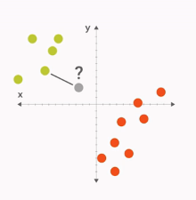
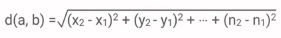

## K近邻（k-Nearest Neighbour）

### 简介

- 对于一个测试点，看它最近的邻居属于那个类别
- 考虑最近邻居的时候，我们可以综合考虑与这个点距离最近的K个点，看它们中有多少输入类别A，多少属于类别B
- 距离：两点间的直线距离（Euclidean Distance）

- 即考虑各个feature之间差异的平方和

### 实现

- fit：用于训练，将训练集的feature和label作为输入
- predict: prediction，将测试集的feature作为输入，输出预测的label
- 设置k=1，也就是我们只考虑最近的那个点属于那个类别
- 用scipy.spatial.distance来计算距离
- 返回测试点最近邻的label

### 总结

- 优点：简单

- 缺点：不能进行复杂的计算