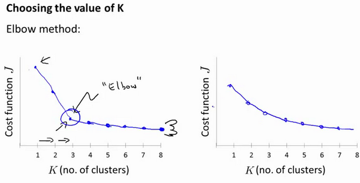

## K-均值

**K-均值**是一个迭代算法，假设我们想要将数据聚类成n个组，其方法为:

首先选择个随机的点，称为**聚类中心**（**cluster centroids**）；

对于数据集中的每一个数据，按照距离个中心点的距离，将其与距离最近的中心点关联起来，与同一个中心点关联的所有点聚成一类。

计算每一个组的平均值，将该组所关联的中心点移动到平均值的位置。

只有数据集中样本分类有变化，即对数据集中每一个数据重新归类，然后移动中心点。

在运行K-均值算法的之前，我们首先要随机初始化所有的聚类中心点，下面介绍怎样做：

1. 我们应该选择，即聚类中心点的个数要小于所有训练集实例的数量
2. 随机选择个训练实例，然后令个聚类中心分别与这个训练实例相等

**K-均值**的一个问题在于，它有可能会停留在一个局部最小值处，而这取决于初始化的情况。

为了解决这个问题，我们通常需要多次运行**K-均值**算法，每一次都重新进行随机初始化，最后再比较多次运行**K-均值**的结果，选择代价函数最小的结果。这种方法在较小的时候（2--10）还是可行的，但是如果较大，这么做也可能不会有明显地改善。

没有所谓最好的选择聚类数的方法，通常是需要根据不同的问题，人工进行选择的。选择的时候思考我们运用**K-均值**算法聚类的动机是什么，然后选择能最好服务于该目的标聚类数。

当人们在讨论，选择聚类数目的方法时，有一个可能会谈及的方法叫作“肘部法则”。关于“肘部法则”，我们所需要做的是改变$K$值，也就是聚类类别数目的总数。我们用一个聚类来运行**K均值**聚类方法。这就意味着，所有的数据都会分到一个聚类里，然后计算成本函数或者计算畸变函数$J$。$K$代表聚类数字。

我们可能会得到一条类似于这样的曲线。像一个人的肘部。这就是“肘部法则”所做的，让我们来看这样一个图，看起来就好像有一个很清楚的肘在那儿。好像人的手臂，如果你伸出你的胳膊，那么这就是你的肩关节、肘关节、手。这就是“肘部法则”。你会发现这种模式，它的畸变值会迅速下降，从1到2，从2到3之后，你会在3的时候达到一个肘点。在此之后，畸变值就下降的非常慢，看起来就像使用3个聚类来进行聚类是正确的，这是因为那个点是曲线的肘点，畸变值下降得很快，$K=3$之后就下降得很慢，那么我们就选$K=3$。当你应用“肘部法则”的时候，如果你得到了一个像上面这样的图，那么这将是一种用来选择聚类个数的合理方法。

