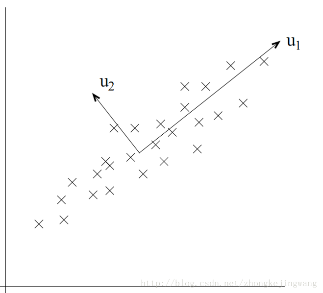

## 主成分分析(PCA)

### 降维的目的

1. 压缩数据
2. 可视化数据

### PCA

 在一般的特征选择问题中，剔除的特征主要是和类标签无关的特征，而这里的特征很多是和类标签有关的，但里面存在噪声或者冗余。在这种情况下，需要一种特征降维的方法来减少特征数，减少噪音和冗余，减少过度拟合的可能性。**主成分分析法(PCA)**就是属于这类降维的方法。

PCA的思想是将n维特征映射到k维上（k<n），这k维是全新的正交特征。这k维特征被称为主成分，是重新构造出来的k维特征，而不是简单地从n维特征中去除其余n-k维特征。

在**PCA**中，我们要做的是找到一个方向向量（**Vector direction**），当我们把所有的数据都投射到该向量上时，我们希望投射平均均方误差能尽可能地小。方向向量是一个经过原点的向量，而投射误差是从特征向量向该方向向量作垂线的长度。

所以，主成分分析中，首先对给定数据进行规范化，使得数据每一变量的平均值为0，方差为1。之后对数据进行正交变换，原来由线性相关变量表示的数据，通过正交变换变成由若干个线性无关的新变量表示的数据。

#### 最大方差理论

在信号处理中认为信号具有较大的方差，噪声有较小的方差，信噪比就是信号与噪声的方差比，越大越好。如下图，样本在u1上的投影方差较大，在u2上的投影方差较小，那么可认为u2上的投影是由噪声引起的。

主成分分析旨在选区正交变换中方差最大的变量，作为第一主成分，也就是旋转变换中坐标值的平方和最大的轴。

根据勾股定理，等价地，主成分分析在旋转变换中选取离样本点的距离平方和最小的轴，即投射平均均方误差最小的轴，作为第一主成分。

#### 区别线性回归

主成分分析与线性回归是两种不同的算法。主成分分析最小化的是投射误差（**Projected Error**），而线性回归尝试的是最小化预测误差。线性回归的目的是预测结果，而主成分分析不作任何预测。

### 线性变换

一个矩阵与一个列向量A相乘，等到一个新的列向量B，则称该矩阵为列向量A到列向量B的线性变换。

我们希望投影后投影值尽可能分散，而这种分散程度，可以用数学上的方差来表述。

即寻找一个一维基，使得所有数据变换为这个基上的坐标表示后，方差值最大。

解释：方差越大，说明数据越分散。通常认为，数据的某个特征维度上数据越分散，该特征越重要。

对于更高维度，还有一个问题需要解决，考虑三维降到二维问题。与之前相同，首先我们希望找到一个方向使得投影后方差最大，这样就完成了第一个方向的选择，继而我们选择第二个投影方向。如果我们还是单纯只选择方差最大的方向，很明显，这个方向与第一个方向应该是“几乎重合在一起”，显然这样的维度是没有用的，因此，应该有其他约束条件——就是正交。

解释：从直观上说，让两个字段尽可能表示更多的原始信息，我们是不希望它们之间存在（线性）相关性的，因为相关性意味着两个字段不是完全独立，必然存在重复表示的信息。字段在本文中指，降维后的样本的特征轴。

数学上可以用两个字段的协方差表示其相关性。

当协方差为0时，表示两个字段线性不相关。

总结一下，PCA的优化目标是：
将一组N维向量降为K维（K大于0，小于N），其目标是选择K个单位正交基，使得原始数据变换到这组基上后，各字段两两间协方差为0，而字段的方差则尽可能大。

所以现在的重点是**方差和协方差**。

### 进一步讨论

根据上面对PCA的数学原理的解释，我们可以了解到一些PCA的能力和限制。PCA本质上是将方差最大的方向作为主要特征，并且在各个正交方向上将数据“离相关”，也就是让它们在不同正交方向上没有相关性。

因此，PCA也存在一些限制，例如它可以很好的解除线性相关，但是对于高阶相关性就没有办法了，对于存在高阶相关性的数据，可以考虑Kernel PCA，通过Kernel函数将非线性相关转为线性相关，关于这点就不展开讨论了。另外，PCA假设数据各主特征是分布在正交方向上，如果在非正交方向上存在几个方差较大的方向，PCA的效果就大打折扣了。

最后需要说明的是，PCA是一种无参数技术，也就是说面对同样的数据，如果不考虑清洗，谁来做结果都一样，没有主观参数的介入，所以PCA便于通用实现，但是本身无法个性化的优化。

------

参考

[图文并茂的PCA教程](<https://blog.csdn.net/hustqb/article/details/78394058>)

[一篇深入剖析PCA的好文](https://www.cnblogs.com/hadoop2015/p/7419087.html)

[详细解释主成分分析](<https://blog.csdn.net/lanyuelvyun/article/details/82384179>)

