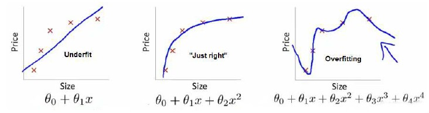

## 正则化

### 过拟合

过于强调拟合原始数据，而丢失了算法的本质：预测新数据。若给出一个新的值使之预测，它将表现的很差。

我们来看一个过拟合的例子：

第一个模型是一个线性模型，欠拟合，不能很好地适应我们的训练集；第三个模型是一个四次方的模型，过于强调拟合原始数据,如果给出一个新的值来预测，则明显预测效果会很差，这就是过拟合。

问题是，如果我们发现了过拟合问题，应该如何处理？

1. 丢弃一些不能帮助我们正确预测的特征。可以是手工选择保留哪些特征，或者使用一些模型选择的算法来帮忙（例如**PCA**）
2. 正则化。 保留所有的特征，但是减少参数的大小。

### 正则化

#### 基本思想

高次项导致了过拟合的产生，所以如果我们能让这些高次项的系数接近于0的话，就可以很好的拟合了， 所以我们要做的就是在一定程度上减小这些参数$θ ​$的值。

但是一般情况下我们有很多的特征，我们并不知道其中哪些特征我们要惩罚，我们将对所有的特征进行惩罚，并且让代价函数最优化的软件来选择这些惩罚的程度。这样的结果是得到了一个较为简单的能防止过拟合问题的假设：
$$
 J\left( \theta  \right)=\frac{1}{2m}[\sum\limits_{i=1}^{m}{{{({h_\theta}({{x}^{(i)}})-{{y}^{(i)}})}^{2}}+\lambda \sum\limits_{j=1}^{n}{\theta_{j}^{2}}]}
$$
其中$\lambda $又称为正则化参数（**Regularization Parameter**）。

如果选择的正则化参数$\lambda$ 过大，则会把所有的参数都最小化了，导致模型变成 ${h_\theta}\left( x \right)={\theta_{0}}$，也就是上图中红色直线所示的情况，造成欠拟合。
那为什么增加的一项$\lambda =\sum\limits_{j=1}^{n}{\theta_j^{2}}$ 可以使$\theta $的值减小呢？
因为如果我们令 $\lambda$ 的值很大的话，为了使**Cost Function** 尽可能的小，所有的 $\theta $ 的值（不包括${\theta_{0}}$）都会在一定程度上减小。
但若$\lambda$ 的值太大了，那么$\theta $（不包括${\theta_{0}}$）都会趋近于0，这样我们所得到的只能是一条平行于$x$轴的直线。
所以对于正则化，我们要取一个合理的 $\lambda$ 的值，这样才能更好的应用正则化。

