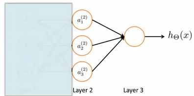
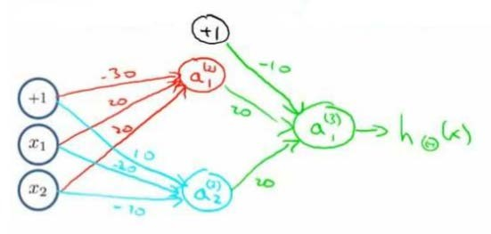

## 神经网络概述

### 为什么要使用神经网络？

无论是线性回归还是逻辑回归都有这样一个缺点，即：当特征太多时，计算的成本会非常大。

而事实证明，使用神经网络可以很好的解决这个问题。

### 背景

神经网络是一种模拟人脑的神经网络以期能够实现类人工智能的机器学习技术。神经网络最初产生的目的是制造能模拟大脑的机器，其逐渐兴起于二十世纪八九十年代，应用得非常广泛。但由于各种原因，在90年代的后期应用减少了。但是最近，神经网络又东山再起了。其中一个原因是：神经网络是计算量有些偏大的算法。然而大概由于近些年计算机的运行速度变快，才足以真正运行起大规模的神经网络。正是由于这个原因和技术方面的突破，如今的神经网络对于许多应用来说是最先进的技术。

### 模型表示

如图是简单的神经网络：

图为三层神经网络，第一层成为输入层（**Input Layer**），最后一层称为输出层（**Output Layer**），中间一层成为隐藏层（**Hidden Layers**）。其中$x_1$, $x_2$, $x_3$是输入单元（**input units**），我们将原始数据输入给它们。$a_1$, $a_2$, $a_3$是中间单元，它们负责将数据进行处理，然后呈递到下一层。最后是输出单元，它负责计算${h_\theta}\left( x \right)$。

另外有如下标注：
$a_{i}^{\left( j \right)}$ 代表第$j$ 层的第 $i$ 个激活单元。${{\theta }^{\left( j \right)}}$代表从第 $j$ 层映射到第$ j+1$ 层时的**权重矩阵**，例如${{\theta }^{\left( 1 \right)}}$代表从第一层映射到第二层的权重的矩阵。其尺寸为：以第 $j+1$层的激活单元数量为行数，以第 $j$ 层的激活单元数加一为列数的矩阵。例如：上图所示的神经网络中${{\theta }^{\left( 1 \right)}}​$的尺寸为 3*4。

对于上图所示的模型，激活单元和输出分别表达为：

$a_{1}^{(2)}=g(\Theta _{10}^{(1)}{{x}_{0}}+\Theta _{11}^{(1)}{{x}_{1}}+\Theta _{12}^{(1)}{{x}_{2}}+\Theta _{13}^{(1)}{{x}_{3}})$
$a_{2}^{(2)}=g(\Theta _{20}^{(1)}{{x}_{0}}+\Theta _{21}^{(1)}{{x}_{1}}+\Theta _{22}^{(1)}{{x}_{2}}+\Theta _{23}^{(1)}{{x}_{3}})$
$a_{3}^{(2)}=g(\Theta _{30}^{(1)}{{x}_{0}}+\Theta _{31}^{(1)}{{x}_{1}}+\Theta _{32}^{(1)}{{x}_{2}}+\Theta _{33}^{(1)}{{x}_{3}})$
${{h}_{\Theta }}(x)=g(\Theta _{10}^{(2)}a_{0}^{(2)}+\Theta _{11}^{(2)}a_{1}^{(2)}+\Theta _{12}^{(2)}a_{2}^{(2)}+\Theta _{13}^{(2)}a_{3}^{(2)})$

上面进行的讨论中只是将特征矩阵中的一行（一个训练实例）喂给了神经网络，我们需要将整个训练集都喂给我们的神经网络算法来学习模型。

我们把上图左半部分遮住，得到：

不难发现，右半部分其实就是以$a_0, a_1, a_2, a_3$, 按照**Logistic Regression**的方式输出$h_\theta(x)$

其实神经网络就像是**logistic regression**，只不过我们把**logistic regression**中的输入向量$\left[ x_1\sim {x_3} \right]$ 变成了中间层的$\left[ a_1^{(2)}\sim a_3^{(2)} \right]$, 即:  $h_\theta(x)=g\left( \Theta_0^{\left( 2 \right)}a_0^{\left( 2 \right)}+\Theta_1^{\left( 2 \right)}a_1^{\left( 2 \right)}+\Theta_{2}^{\left( 2 \right)}a_{2}^{\left( 2 \right)}+\Theta_{3}^{\left( 2 \right)}a_{3}^{\left( 2 \right)} \right)$ 
我们可以把$a_0, a_1, a_2, a_3$看成更为高级的特征值，也就是$x_0, x_1, x_2, x_3$的进化体，并且它们是由 $x$与$\theta$决定的，使用这些训练出来的特征值，可以更好的预测新数据。这就是神经网络相比于逻辑回归和线性回归的优势。这里我们将第一层到输出层的计算过程称为**前向传播**。

### 举例

下图的神经元（三个权重分别为-30，20，20）可以被视为作用同于逻辑与（**AND**）：

下图的神经元（三个权重分别为-10，20，20）可以被视为作用等同于逻辑或（**OR**）：

下图的神经元（两个权重分别为 10，-20）可以被视为作用等同于逻辑非（**NOT**）：

我们可以利用神经元来组合成更为复杂的神经网络以实现更复杂的运算。例如我们要实现**XNOR** 功能（输入的两个值必须一样，均为1或均为0），即 $\text{XNOR}=( \text{x}_1\, \text{AND}\, \text{x}_2 )\, \text{OR} \left( \left( \text{NOT}\, \text{x}_1 \right) \text{AND} \left( \text{NOT}\, \text{x}_2 \right) \right)$
首先构造一个能表达$\left( \text{NOT}\, \text{x}_1 \right) \text{AND} \left( \text{NOT}\, \text{x}_2 \right)​$部分的神经元：

然后将表示 **AND** 的神经元和表示$\left( \text{NOT}\, \text{x}_1 \right) \text{AND} \left( \text{NOT}\, \text{x}_2 \right)$的神经元以及表示 OR 的神经元进行组合：

我们就得到了一个能实现 $\text{XNOR}$ 运算符功能的神经网络。

按这种方法我们可以逐渐构造出越来越复杂的函数，也能得到更加厉害的特征值。

