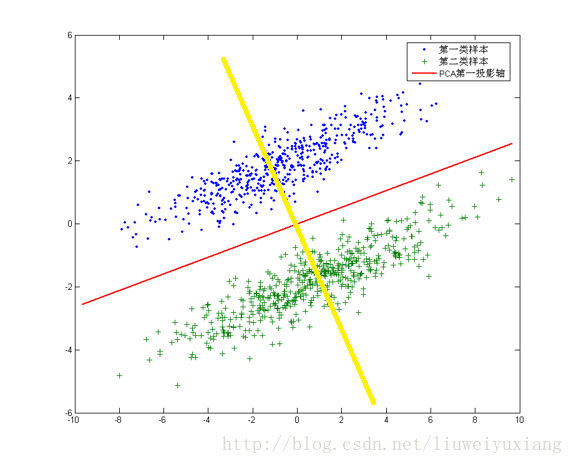

## 线性判别分析(LDA)

### LDA与PCA

我们知道，PCA（主成分分析）是有效的数据降维的方法，与之相同的是LDA也是一种将数据降维的方法。

那既然有了PCA，我们为什么还要LDA呢？

下面我们就来看看PCA与LDA之间的区别与联系。

**PCA是一种无监督的数据降维方法，与之不同的是LDA是一种有监督的数据降维方法**。我们知道即使在训练样本上，我们提供了类别标签，在使用PCA模型的时候，我们是不利用类别标签的，而LDA在进行数据降维的时候是利用数据的类别标签提供的信息的。 

从几何的角度来看，PCA和LDA都是讲数据投影到新的相互正交的坐标轴上。只不过在投影的过程中他们使用的约束是不同的，也可以说目标是不同的。PCA是将数据投影到方差最大的几个相互正交的方向上，以期待保留最多的样本信息，即**PCA降维的目标：将数据投影到方差最大的几个相互正交的方向上**。而**LDA降维的目标：尽可能多地保留数据样本的信息，同时满足投影后使得同类样本尽可能近，不同类样本尽可能远**。比如下图：

针对这个数据集，如果同样选择使用PCA，选择方差最大的方向作为投影方向，来对数据进行降维。那么PCA选出的最佳投影方向，将是图中红色直线所示的方向。不难发现，这样做投影之后两类数据样本将混合在一起，将不再线性可分，甚至是不可分的。这对我们来说简直就是地狱，本来线性可分的样本被我们亲手变得不再可分。 但是图中还有一条耀眼的黄色直线，向这条直线做投影即能使数据降维，同时还能保证两类数据仍然是线性可分的。上面的这个数据集如果使用LDA降维，找出的投影方向就是黄色直线所在的方向。 

总体来说，LDA模型实现基本思想是和PCA相同的，都是**高维向低维空间做投影**。

### LDA模型

