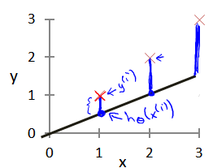
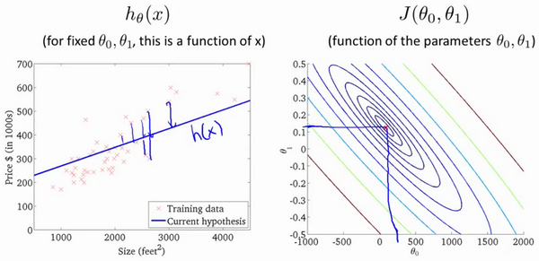

## 单变量线性回归

### 模型表示

以之前的房屋交易问题为例，假使我们回归问题的训练集（**Training Set**）如下表所示：

我们将要用来描述这个回归问题的标记如下:

$m​$ 代表训练集中实例的数量

$x​$ 代表特征/输入变量

$y$ 代表目标变量/输出变量

$(x,y)​$ 代表训练集中的实例

$(x^{(i)},y^{(i)})​$ 代表第i 个观察实例

$h​$ 代表学习算法的解决方案或函数也称为假设（**hypothesis**）

为了更加正式地描述监督学习问题，我们的目标是，在给定训练集的情况下，学习函数$h ：X→Y$，使得​$h（x）$是​$y$的对应值的“好”预测器。由于历史原因，该函数$h$被称为假设。从图中可以看出，这个过程是这样的：

当我们试图预测的目标变量是连续的时，例如在我们的住房示例中，我们将学习问题称为**回归问题**。

当$y$只能承受少量离散值时（例如，如果给定生活区域，我们想要预测住宅是房屋还是公寓，请说），我们将其称为分类问题。

### 代价函数

我们可以使用**代价函数**来衡量我们的假设函数的准确性。这需要假设的所有结果与来自x和实际输出y的输入的平均差异（实际上是平均值的更高版本）。如图：

在线性回归中我们有一个像这样的训练集，$m$代表了训练样本的数量，比如 $m$=47。而我们的假设函数，也就是用来进行预测的函数，是这样的线性函数形式：$h_θ(x)=θ_0+θ_1x$。

接下来我们会引入一些术语我们现在要做的便是为我们的模型选择合适的**参数**（**parameters**）$θ_0 $和$ θ_1​$，在房价问题这个例子中便是直线的斜率和在y 轴上的截距。

我们选择的参数决定了我们得到的直线相对于我们的训练集的准确程度，模型所预测的值与训练集中实际值之间的差距（下图中蓝线所指）就是**建模误差**（**modeling error**）。

我们的目标便是选择出可以使得建模误差的平方和能够最小的模型参数。 

即代价函数

**$J(θ_0,θ_1)=\frac{1}{2m}\sum_{i=1}^m(h_θ(x^{(i)})−y^{(i)})^2​$ **

最小。

假设$θ_0​$为0，样本为$(1,1),(2,2),(3,3)​$，则$J(θ_0,θ_1)​$的图形如下：

我们的目标是最小化代价函数，这里$θ_1=1$ 时，代价函数为最小值。

回到我们的房价上来，对应多个参数，这里使用轮廓图，则$J(θ_0,θ_1)$的图形如下：

通过这些图形，我希望你能更好地理解这些代价函数$J$所表达的值是什么样的，它们对应的假设是什么样的，以及什么样的假设对应的点，更接近于代价函数$J$的最小值。当然，我们真正需要的是一种有效的算法，能够自动地找出这些使代价函数J取最小值的参数$θ_0$和$θ_1$来。而使用**梯度下降**算法，可以自动找出能使代价函数$J$最小化的参数$θ_0$和$θ_1$的值。

### 梯度下降

想象一下你正站立在山的这一点上，站立在你想象的公园这座红色山上，在梯度下降算法中，我们要做的就是旋转360度，看看我们的周围，并问自己要在某个方向上，用小碎步尽快下山。这些小碎步需要朝什么方向？如果我们站在山坡上的这一点，你看一下周围，你会发现最佳的下山方向，你再看看周围，然后再一次想想，我应该从什么方向迈着小碎步下山？然后你按照自己的判断又迈出一步，重复上面的步骤，从这个新的点，你环顾四周，并决定从什么方向将会最快下山，然后又迈进了一小步，并依此类推，直到你接近局部最低点的位置。

梯度下降算法如下：

$θ_j:=θ_j−α\frac∂{∂θ_j}J(θ)​$

描述：对θ赋值，使得J(θ)按梯度下降最快方向进行，一直迭代下去，最终得到局部最小值。其中a是学习率（**learning rate**），它决定了我们沿着能让代价函数下降程度最大的方向向下迈出的步子有多大。

对于这个问题，求导的目的，基本上可以说取这个红点的切线，就是这样一条红色的直线，刚好与函数相切于这一点，让我们看看这条红色直线的斜率，就是这条刚好与函数曲线相切的这条直线，这条直线的斜率正好是这个三角形的高度除以这个水平长度，现在，这条线有一个正斜率，也就是说它有正导数，因此，我得到的新的$θ_1$，$θ_1$更新后等于$θ_1$减去一个正数乘以$a​$。

这就是我梯度下降法的更新规则：$θ_j:=θ_j−α\frac∂{∂θ_j}J(θ)$

在梯度下降法中，当我们接近局部最低点时，梯度下降法会自动采取更小的幅度，这是因为当我们接近局部最低点时，很显然在局部最低时导数等于零，所以当我们接近局部最低时，导数值会自动变得越来越小，所以梯度下降将自动采取较小的幅度，这就是梯度下降的做法。所以实际上没有必要再另外减小$a​$。

对我们之前的线性回归问题运用梯度下降法，关键在于求出代价函数的导数，则有

**Repeat {**

 $θ_0:=θ_0−a\frac1m\sum_{i=1}^m(h_θ(x^{(i)})−y^{(i)})​$

$θ_1:=θ_1−a\frac1m\sum_{i=1}^m((h_θ(x^{(i)})−y^{(i)})$⋅x(i))

 **}**

我们刚刚使用的算法，有时也称为**批量梯度下降**。这个名字”**批量梯度下降**”，指的是在梯度下降的每一步中，我们都用到了所有的训练样本，在梯度下降中，在计算微分求导项时，我们需要进行求和运算，所以，在每一个单独的梯度下降中，我们最终都要计算这样一个东西，这个项需要对所有m个训练样本求和。

## 多变量线性回归

### 多变量的梯度下降

梯度下降方程本身通常是相同的形式。下图将梯度下降与一个变量与具有多个变量的梯度下降进行比较：

### 实践中的渐变下降I - 特征缩放

我们可以通过使每个输入值在大致相同的范围内来加速梯度下降。这是因为θ将在小范围内快速下降并且在大范围内缓慢下降，因此当变量非常不均匀时，将无效地振荡到最佳值。

防止这种情况的方法是修改输入变量的范围，使它们大致相同。理想的情况是：

$−1 ≤ x_{(i)}≤ 1​$

要么

$−0.5 ≤ x_{(i)}≤ 0.5​$

这些并不是确切的要求; 我们只是想加快速度。目标是将所有输入变量大致分为这些范围中的一个，给出或取一些。

有两种帮助的技术是**特征缩放**和**均值归一化**。特征缩放涉及将输入值除以输入变量的范围（即最大值减去最小值），从而产生仅1的新范围。均值归一化涉及从该值中减去输入变量的平均值。输入变量导致输入变量的新平均值仅为零。要实现这两种技术，请调整输入值，如下面的公式所示：

$x_{i}=\frac{x_{i}-u_{i}}{s_{i}}​$

其中$μ_i$是特征$x_{i}$和的平均值,$s_{i}$是值的范围（最大 - 最小)。

