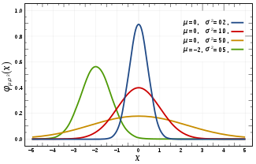
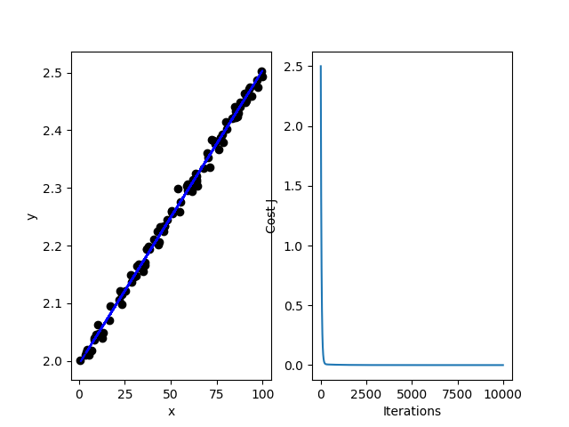

## 李宏毅机器学习Day1-3：线性回归任务一

### 什么是机器学习？

机器学习的核心是“**使用算法解析数据，从中学习，然后对世界上的某件事情做出决定或预测**”。

Tom Mitchell提供了一个更现代的定义：“据说计算机程序从经验E中学习某些任务T和绩效测量P，如果它在T中的任务中的表现，由P测量，随经验E而改善。 “

示例：玩跳棋。

E =玩许多跳棋游戏的经验

T =玩跳棋的任务。

P =程序赢得下一场比赛的概率。

### 中心极限定理

中心极限定理指的是给定一个任意分布的总体。我每次从这些总体中随机抽取 n 个抽样，一共抽 m 次。 然后把这 m 组抽样分别求出平均值。 这些平均值的分布接近**正态分布**。

### 正态分布

#### 概率密度函数

在数学中，连续型随机变量的**概率密度函数**（Probability density function）是一个描述这个随机变量的输出值，在某个确定的取值点附近的可能性的函数。**累积分布函数**是概率密度函数的积分。

也叫高斯分布。其概率密度公式为：

$f(x)=\frac{1}{\sigma \sqrt{2 \pi}} e^{-\frac{(x-\mu)^{2}}{2 \sigma^{2}}}​$

其中$u$为均值，$\sigma^{2}$为方差。

如果一个随机变量$X$服从这个分布，我们写作$X$~$N(\mu, \sigma^2)$, 如果$u=0$,且$\sigma=1$,则这个分布被称为**标准正态分布**。

下面是四个不同参数的概率密度函数:



### 最大似然估计

最大似然估计是一种确定模型参数值的方法，基于**最大似然原理**提出。确定参数值的过程，是找到能最大化模型产生真实观察数据可能性的那一组参数。

#### 最大似然原理

> 概率大的事件在一次观测中更容易发生。
> 在一次观测中发生了的事件其概率应该大。

举例：

>1. 某同学与一位猎人一起外出打猎。忽然，一只野兔从前方窜过，只听一声枪响，野兔应声倒下，请问：是谁击中了野兔？
>2. 事件A，发生的概率p只可能为0.1,0.3或0.6，在一次观测中，A发生了，请问：p为何值？

#### 计算最大似然估计

给定一个概率分布$ {\displaystyle D} $,已知其概率密度函数（连续分布）或概率质量函数（离散分布）为$ {\displaystyle f_{D}}$，以及一个分布参数 ${\displaystyle \theta }$，我们可以从这个分布中抽出一个具有$ n $个值的采样 ${\displaystyle X_{1},X_{2},\ldots ,X_{n}}$，利用 ${\displaystyle f_{D}}​$计算出其似然函数：

${\displaystyle {\mbox{L}}(\theta \mid x_{1},\dots ,x_{n})=f_{\theta }(x_{1},\dots ,x_{n})} $

若$ {\displaystyle D} $是离散分布， ${\displaystyle f_{\theta }}$即是在参数为$ {\displaystyle \theta }$时观测到这一采样的概率。若其是连续分布，  ${\displaystyle f_{\theta }}$ 则为 ${\displaystyle X_{1},X_{2},\ldots ,X_{n}}$联合分布的概率密度函数在观测值处的取值。从数学上来说，我们可以在${\displaystyle f_{\theta }}$ 的所有可能取值中寻找一个参数值使得似然函数取到最大值，这个参数值被称为最大似然估计（maximum likelihood estimates，MLE）。

步骤如下：

- **取对数**
- **求导数，得驻点，最大值点**
- **作结论**

#### 小结

##### **最大似然估计总是能精确地得到解吗？**

简单来说，不能。更有可能的是，在真实的场景中，对数似然函数的导数仍然是难以解析的（也就是说，很难甚至不可能人工对函数求微分）。因此，一般采用期望最大化（EM）算法等迭代方法为参数估计找到数值解，但总体思路还是一样的。

**什么时候最小二乘参数估计和最大似然估计结果相同？**

最小二乘法是另一种常用的机器学习模型参数估计方法。结果表明，当模型向上述例子中一样被假设为高斯分布时，MLE 的估计等价于最小二乘法。

对于最小二乘参数估计，我们想要找到最小化数据点和回归线之间距离平方之和的直线。在最大似然估计中，我们想要最大化数据同时出现的总概率。当待求分布被假设为高斯分布时，最大概率会在数据点接近平均值时找到。由于高斯分布是对称的，这等价于最小化数据点与平均值之间的距离。

### 推导回归Loss Function

**损失函数**（loss function）是用来估量你模型的预测值$f(x)​$与真实值$Y​$的不一致程度，损失函数越小，模型的鲁棒性就越好。这里我们使用均方误差(MSE)作为我们的损失函数。

定义：
$$
\begin{aligned}  
L(w,b) & = \sum_{j=1}^{m}\left ( y^{(j)}- f(x^{(j)}) \right )^2，
其中 f(x)=b+\sum_{i=1}^{n} w_{i} x_{i},代入得到 \\
& = \sum_{j=1}^{m}\left(y^{(j)}-\left(b+\sum_{i=1}^{n} w_{i} x_{i}^{(j)}\right)\right)^{2}\\
\end{aligned}
$$


其中 $（x^{(j)}，y^{(j)}）$为 样本点，$m$为样本点计数，$x_i$为训练集特征值，$w_i$为权重，$b$为偏置值，$f(x)$为模型函数。

**注：本文里的损失函数其实是代价函数，这里没有一个公认的区别标准，别的说法里损失函数主要指的是对于单个样本的损失或误差，这里我们等同与代价函数，表示多样本误差的总和。**

### 损失函数与凸函数

在使用梯度下降进行最小化损失函数的时候，如果损失函数是凸函数，那么不管怎么初始化，总能找到全局最优解。否则，很有可能陷入局部最优解。

### 泰勒展开

泰勒展开是将一个在$x=x_0$处具有n阶导数的函数$f(x)$利用关于$(x-x0)$的n次多项式来逼近函数的方法。

设 n 是一个正整数。如果定义在一个包含 a 的区间上的函数 f 在 a 点处 n+1 次可导，那么对于这个区间上的任意 x，都有：

$f(x)=f(a)+\frac{f^{\prime}(a)}{1 !}(x-a)+\frac{f^{(2)}(a)}{2 !}(x-a)^{2}+\cdots+\frac{f^{(n)}(a)}{n !}(x-a)^{n}+R_{n}(x)​$

表示$f^{(n)}(a)$ $f(x)$的n阶导数，等号后的多项式称为函数$f(x)$在$a$处的泰勒展开式，剩余的$R_n(x)$是泰勒公式的余项，是$(x-a)^n​$的高阶无穷小。

### 推导梯度下降

梯度下降算法如下：

$θ_j:=θ_j−α\frac∂{∂θ_j}L(θ)​$

$a$为学习率（步长）。

推导过程基于泰勒展开的一阶项：

$f(\theta)=f(\theta_0)+(\theta-\theta_0){\bigtriangledown}f(\theta_0)​$

为了最小化函数，希望函数往使函数减小的方向变化，则有：

$(\theta-\theta_0){\bigtriangledown}f(\theta_0) < 0​$,

其中 $(\theta-\theta_0)​$ 是微小矢量，可表示为$a^{'}v​$, $a^{'}​$类似上面提到的学习率，为正值，取尽量小的值，$v​$为该方向上的单位向量，

所有上面的不等式变成：

$v{\bigtriangledown}f(\theta_0) < 0​$

然后根据两个向量乘积，我们知道两个向量方向相反可取向量乘积最小值，不难得：

$θ=θ_0−α{\bigtriangledown}f(\theta_0)$, $a$为$a^{'}$与${\bigtriangledown}f(\theta_0)$的模的乘积。


### 梯度下降代码实现

```pyth
"""
    自己实现
    梯度下降解决线性回归问题
"""
import numpy as np
import matplotlib.pyplot as plt

def costFunction(X, y, theta=[0, 0]):
    """
        损失函数
    """
    m = y.size
    h = X.dot(theta)
    J = 1.0 / (2 * m) * (np.sum(np.square(h - y)))
    return J

def gradientDescent(X, y, theta=[0, 0], alpha=0.01, num_iters=1500):
    """
        梯度下降
    """
    m = y.size
    J_history = np.zeros(num_iters)
    for iter in np.arange(num_iters):
        h = X.dot(theta)
        theta = theta - alpha * (1.0 / m) * (X.T.dot(h - y))
        J_history[iter] = costFunction(X, y, theta)
    return (theta, J_history)

def MaxMinNormalization(x):
    """
        归一化
    """
    Min = np.min(x)
    Max = np.max(x)
    x = (x - Min) / (Max - Min)
    return x


# 自己构造数据集
X_row = 100 * np.random.rand(100)
X = MaxMinNormalization(X_row)
y = 0.5*X + 2 + np.random.normal(0,0.01,(100,))

# 数据可视化
plt.subplot(1, 2, 1)
plt.scatter(X_row, y, color='black')
plt.xlabel('x')
plt.ylabel('y')

X = np.c_[np.ones((X.shape[0],1)), X]


# training set
X_train = X[:80]
y_train = y[:80]
# test set
X_test = X[80:]
y_test = y[80:]


b = 0
w = 0
lr = 0.01
iteration = 10000

# 画出每一次迭代和损失函数变化
theta , Cost_J = gradientDescent(X_train, y_train, theta=[b, w], alpha= lr, num_iters= iteration)

print('最终b, w结果: ',theta)
testCost = costFunction(X_test, y_test, theta)
print('测试集误差: ',testCost)

h = X.dot(theta)
plt.plot(X_row, h, "b--")
plt.subplot(1, 2, 2)
plt.plot(Cost_J)
plt.ylabel('Cost J')
plt.xlabel('Iterations')
plt.show()
```

结果如下：

```
最终b, w结果:  [1.99788294 0.50547522]
测试集误差:  5.113037555609278e-05
```



### 学习L2-Norm，L1-Norm，L0-Norm

>范数是一种强化了的距离概念，它在定义上比距离多了一条数乘的运算法则。有时候为了便于理解，我们可以把范数当作距离来理解。
>
>L0范数是指向量中非0的元素的个数。
>
>L1范数是指向量中非零元素绝对值之和。
>
>L2范数是指向量各元素的平方和然后求平方根，L2范数通常会被用来做优化目标函数的正则化项，防止模型为了迎合训练集而过于复杂造成过拟合的情况，从而提高模型的泛化能力。

### 推导正则化公式

参考[L2正则化推导](<https://blog.csdn.net/winone361/article/details/82555283>)

### 为什么用L1-Norm代替L0-Norm

L0-Norm 优化的目标是使大多数参数为0，即W是稀疏的。但L0范数的优化问题是NP hard，且可证L1范数是L0范数的最优凸近似，因此通常使用L1范数来代替。

### 为什么正则化时只对w/Θ做限制，不对b做限制

模型的复杂程度是由w/θ决定的，b只是起到平移模型的作用。缩小b不能使模型简化，只能使模型分界面趋于靠近原点。相反，对w的限制可以实现对特征的惩罚，留取更重要的特征，惩罚不重要的特征权重，从而使Loss Function更平滑，提高泛化能力，防止过拟合。

------

参考：

[从最大似然估计开始，你需要打下的机器学习基石](<https://blog.csdn.net/tkkzc3E6s4Ou4/article/details/79016194>)

[L2正则化推导](<https://blog.csdn.net/winone361/article/details/82555283>)