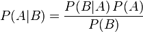

## 李宏毅机器学习Day11-13：机器学习任务四

### 推导贝叶斯公式，朴素贝叶斯公式

#### 定义

**贝叶斯定理**是关于随机事件 A 和 B 的条件概率：

其中P(A|B)是在 B 发生的情况下 A 发生的可能性。

在贝叶斯定理中，每个名词都有约定俗成的名称：

1. `P(A)是 A 的先验概率，之所以称为“先验”是因为它不考虑任何 B 方面的因素。`
2. `P(A|B)是已知 B 发生后 A 的条件概率，也由于得自 B 的取值而被称作 A 的后验概率。`
3. `P(B|A)是已知 A 发生后 B 的条件概率，也由于得自 A 的取值而被称作 B 的后验概率。`
4. `P(B)是 B 的先验概率，也作标淮化常量（normalizing constant）。`

联合概率：表示两个事件共同发生（数学概念上的交集）的概率。A 与 B 的联合概率表示为$P(B∩A)$。

#### 推导

根据条件概率的定义，在事件 B 发生的条件下事件 A 发生的概率为：

$P(A|B)=\frac{P(A\cap B)}{P(B)}​$

同样地，在事件 A 发生的条件下事件 B 发生的概率为：

$P(B|A)=\frac{P(B\cap A)}{P(A)}​$

结合这两个方程式，我们可以得到：

$P(A|B)P(B)  = P(B|A)P(A)  $

上式两边同除以 P(A)，若P(A)是非零的，我们可以得到**贝叶斯定理**:

该定理提供了一种计算的逆条件概率的方法，用已知的数据，来求取无法预知数据发生的概率。

这里$P(B)$ 可以根据**全概率公式**求出。

基于这样的一个假定：“给定目标值时属性之间相互条件独立”，基于这样的朴素的假定，上式也成为

**朴素贝叶斯公式**。

#### 举例分析

假设两个盒子，各装了5个球，还得知随机抽一个球，抽到的是盒子1的球的概率是 2/3，是盒子2的球的概率是1/3。从盒子中蓝色球和绿色球的分配可以得到：

- 在盒子1中随机抽一个球，是蓝色的概率为 4/5，绿的的概率为 1/5。
- 在盒子2中随机抽一个球，是蓝色的概率为 2/5，绿的的概率为 3/5。

那么问题来了，随机从两个盒子中抽一个球，抽到的是盒子1中蓝色球的概率是多少？

由题目，已知：

$P(Blue∣B1) = 4/5​$

$P(B1) = 2/3​$

$P(Blue) = P(Blue∣B1) P(B1) + P(Blue∣B1) P(B2) = 4/5*2/3+2/5*1/3$ = 2/3

基于上面公式，得：

$P(B1∣Blue) = \frac{P(Blue∣B1) P(B1)}{P(Blue)} = 4/5 ​$ 

### 先验概率和后验概率

先验概率是指根据以往经验和分析得到的概率，而不依赖于其他方面的因素。

后验概率是指事件发生的可能原因的概率。

### LR和linear regression区别

这里的LR意值逻辑回归。

逻辑回归和线性回归都属于广义线性回归。

区别如下：

1. 线性回归的输出是连续值，逻辑回归的输出区间为[0,1]，可简单理解为事件发生的概率，基于该概率做分类。
2. 逻辑回归是线性回归被sigmoid函数映射后的结果。

### 推导sigmoid function公式

根据贝叶斯定理及高斯分布，我们可以推导**s函数**。

过程如下：

