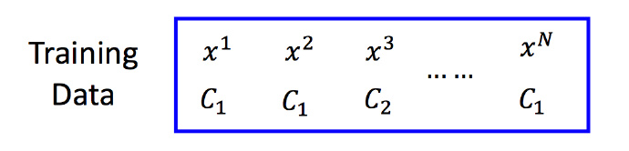
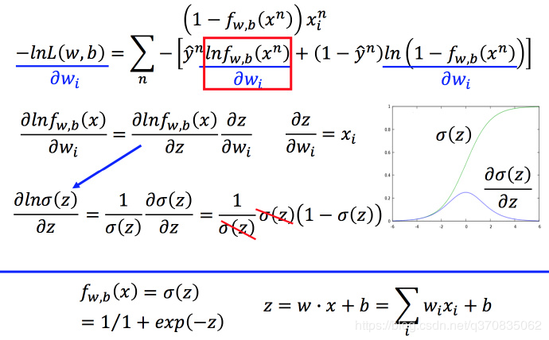
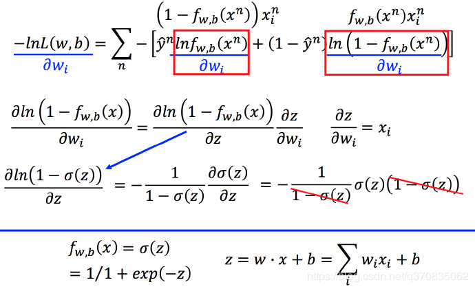
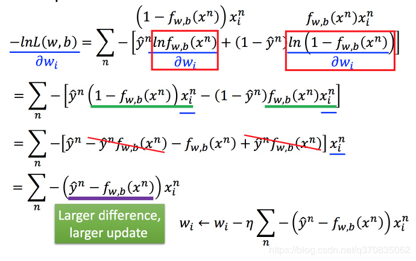
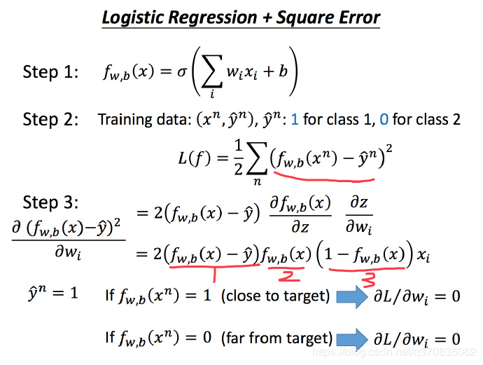

## 李宏毅机器学习Day14-16：逻辑回归

### 推导LR损失函数

假设我们有一组训练集，类别为c1，c2，数据基于后验概率$f_{w,b}(x) = P_{w,b}(c_1|x) = g(z)​$产生。

其中$g\left( z \right)=\frac{1}{1+{{e}^{-z}}}$，$z=\sum_\limits{i=0}^{d}w_ix_i+b$，$d​$表示属性数目。



基于**最大似然法**，有：

$L_{(w,b)}=f_{w,b}(x^1)f_{w,b}(x^2)(1−f_{w,b}(x^3))⋯f_{w,b}(x^N)$

对于使得 $L(w,b)​$最大的$w​$和 $b​$，记做$w^∗​$和 $b^∗​$，即：

$w^∗, b^∗=argmaxL(w,b) ​$

对其取负自然对数后，转化为：

$w^∗, b^∗=argmaxL(w,b) = argmin(-lnL(w,b))​$，

其中，有：

$-lnL(w,b)=-lnf_{w,b}(x^1)-lnf_{w,b}(x^2)-ln(1−f_{w,b}(x^3))⋯-lnf_{w,b}(x^N)​$

$=\sum_\limits{i=0}^{m}-[y^ilnf(x^i)+(1-y^i)ln(1-f(x^i))]​$

$m$为样本数，$y^i$代表C1或者C2所对应的数值，这里$f_{w,b}(x)$对应的C1，所以表示C1时，$y^i$=1，表示C2时，$y^i​$=0。

### 学习LR梯度下降

LR梯度下降推导如下：







得到梯度下降算法如下：

**Repeat** {
$w_i :=w_i  - η \sum\limits_{n}-(y^n-f_{w,b}(x^n))x_i^n$ 
**(simultaneously update all** )
}

### 为什么不用平方误差做损失函数？

1. 如果是交叉熵，距离target越远，微分值就越大，就可以做到距离target越远，更新参数越快。而平方误差在距离target很远的时候，微分值非常小，会造成移动的速度非常慢。如图，假设 $y^n=1$ ，如果 $f_{w,b}(x^n)=1$，就是非常接近target，会导致偏微分中第一部分为0，从而偏微分为0；而$f_{w,b}(x^n)0=$，会导致第二部分为0，从而偏微分也是0。

   

2. 对于线性回归模型，我们定义的代价函数是所有模型误差的平方和。理论上来说，我们也可以对逻辑回归模型沿用这个定义，但是问题在于，当我们将带入到这样定义了的代价函数中时，我们得到的代价函数将是一个非凸函数。


这意味着我们的代价函数有许多局部最小值，这将影响梯度下降算法寻找全局最小值。

### 代码实现梯度下降

```python
import numpy as np

#定义sigmoid函数
def sigmoid(z):
    return(1 / (1 + np.exp(-z)))


# 定义损失函数
def costFunction(theta, X, y):
    m = y.size
    h = sigmoid(X.dot(theta))
    J = -1.0 * (1.0 / m) * (np.log(h).T.dot(y) + np.log(1 - h).T.dot(1 - y))
    if np.isnan(J):
        return (np.inf)
    return J


# 求解梯度
def gradient(theta, X, y):
    m = y.size
    h = sigmoid(X.dot(theta))
    grad = (1.0 / m) * X.T.dot(h - y)
    return (grad)
```

### Softmax

softmax就是如果判断输入属于某一个类的概率大于属于其他类的概率，那么这个类对应的值就逼近于1，其他类的值就逼近于0。该算法主要应用就是多分类，而且是互斥的，即只能属于其中的一个类。

关于Softmax 函数的定义如下所示：

$S_i=\frac{e^{V_i}}{\sum_\limits{i}^{C}e^{V_i}}$

其中，$V_i $是分类器前级输出单元的输出。$i$ 表示类别索引，总的类别个数为 $C$。$S_i $表示的是当前元素的指数与所有元素指数和的比值。

#### softmax损失函数

在多分类问题中，我们经常使用**交叉熵**作为损失函数，其形式如下：

$Loss = - \sum_\limits{i}y_ilna_i​$

其中$y$代表我们的真实值，$a$代表我们softmax求出的值。

#### softmax梯度下降

------

参考：

[softmax回归推导](<https://blog.csdn.net/google19890102/article/details/49738427>)