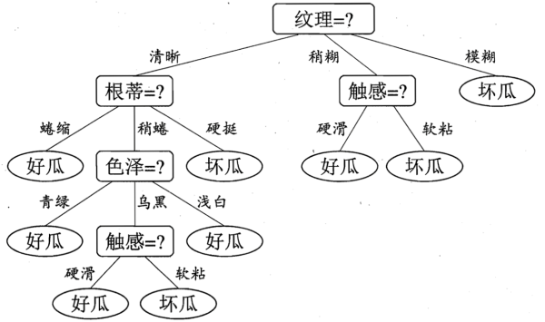

## 李宏毅机器学习Day23-26:决策树任务二

### 决策树模型结构

决策树是一种常见的机器学习方法，它基于二元划分策略（类似于二叉树），如下图所示



一棵决策树包括一个根节点、若干个内部节点和若干个叶节点。叶节点对应决策的结果，而其他节点对应一个属性测试。决策树学习的目的就是构建一棵泛化能力强的决策树。决策树算法的优点包括：

- 算法比较简单。
- 理论易于理解。
- 对噪声数据有很好的健壮性。

如何选择最优划分属性是决策树学习的关键。

### 决策树递归思想

从所有可能的决策树模型中选择最优决策树是NP完全问题，通常我们得到的决策树是次最优的，即不一定是全局最优，而是在一个节点处做到最优，决策树的构建属于贪心策略。

决策树学习算法通常是递归地选择最优特征，并根据该特征对训练数据集进行分割，使得对各个子数据集有一个最好的分类的过程。

### 信息增益

条件熵代表在某一个条件下，随机变量的复杂度（不确定度）。

信息增益=信息熵-条件熵，代表了在一个条件下，信息复杂度（不确定性）减少的程度。

其定义如下：
$$
Gain(D, a) = Ent(D) - \sum^V_{v=1} \frac{|D^v|}{D} Ent(D^v)
$$

$Ent(D)$为信息熵，假定当前样本集合$D$中第$k$类样本所占比例为$p_k(k=1,2,...y)$，则
$$
Ent(D)=-\sum^y_{k=1}p_klog_2p_k
$$
$V$表示使用某个属性对$D$根据不同的属性值进行划分产生的分支节点数，$ Ent(D^v)$表示第v个属性值对应的分支下的样本集合$D^v$的信息熵。

### 信息增益率

信息增益准则对可取值数目较多的属性有所偏好，所以有些算法不直接信用信息增益，而是使用**增益率**，其定义如下：
$$
Gain_ratio(D, a) = \frac{Gain(D,a)}{IV(a)},
IV(a) = - \sum^V_\limits{v=1}\frac{|D^v|}{D} log_2\frac{|D^v|}{D}
$$

#### ID3算法

ID3算法的核心是在决策树各个节点上应用 信息增益 准则选择特征，递归的构建决策树。具体方法是：从根结点开始，对结点计算所有可能的特征的信息增益，选择信息增益最大的特征作为结点的特征，由该特征的不同取值建立子结点；再对子结点递归的调用以上方法，构建决策树；直到所有特征的信息增益均很小或没有特征可以选择为止。ID3相当于用极大似然法进行概率模型的选择。

**缺点**：只能处理离散型属性，并且对倾向于**选择取值较多的属性**。

**原因**：信息增益反映的给定一个条件以后不确定性减少的程度,必然是分得越细的数据集确定性更高,也就是条件熵越小,信息增益越大。

#### C4.5算法

以信息增益率为准选择决策树的属性。

C4.5算法是ID3算法的一种改进。

**缺点**：偏向于选择取值较多的属性。

### 对连续值的处理

将连续型的属性变量进行离散化处理形成决策树的训练集：

1）将需要处理的样本（对应根节点）或样本子集（对应子树）按照连续变量的大小从小到大进行排序。

2）假设该属性对应不同的属性值共N个，那么总共有N-1个可能的候选分割值点，每个候选的分割阈值点的值为上述排序后的属性值中两两前后连续元素的中点。

3）用信息增益选择最佳划分。

### 代码实现

#### 计算信息熵

```python
def calcShannonEnt(dataSet):
    """ 计算信息熵
    """
    # 获取最后一列的数据
    labels = dataSet[:,-1]
    # 统计所有类别对应出现的次数
    labelCounts = Counter(labels)
    # 数据已准备好，计算熵
    shannonEnt = 0.0
    dataLen = len(dataSet)
    for key in labelCounts:
        pro = labelCounts[key] / dataLen
        shannonEnt -= pro * np.log2(pro)
    return shannonEnt
```

#### 选择最优特征

```python
def chooseFeature(dataSet):
    """
        选择最优属性
        gain = baseEntropy - newEntropy
    """
    baseEntropy = calcShannonEnt(dataSet) # 整个数据集的信息熵
    bestInfoGain = 0.0
    bestFeature = -1
    # 遍历所有属性
    for i in range(len(dataSet[0]) -1):
        splitDict = Counter(dataSet[:, i])
        newEntropy = 0.0
        for v in splitDict:
            subDataSet = dataSet[dataSet[:, i]==v]
            prob = splitDict[v]/float(len(dataSet))
            newEntropy += prob * calcShannonEnt(subDataSet)
        gain = baseEntropy - newEntropy
        if gain > bestInfoGain:
            bestInfoGain = gain
            bestFeature = i
    return bestFeature
```

#### 生成决策树

```python
def createTree(dataSet, feature_labels):
    """
        生成决策树
        返回字典树
        dataSet: 数据集
        feature_labels： 属性标签
    """
    labels = dataSet[:, -1]
    # 数据集样本类别相同
    if len(set(labels)) == 1:
        return labels[0]
    # 属性值为空或者唯一属性值相同，返回样本数最多的类别
    if len(dataSet[0]) == 1 or (len(dataSet[0]) == 2 and len(set(dataSet[:, 0])) == 1):
        resDict = dict(Counter(labels))
        sortedClassCount = sorted(resDict.items(), key=lambda item: item[1], reverse=True)
        return sortedClassCount[0][0]

    # 选择最优属性
    bestFeat = chooseFeature(dataSet)
    bestFeatLabel = feature_labels[bestFeat]
    myTree = {bestFeatLabel:{}}
    del(feature_labels[bestFeat])
    # 对选择属性进行划分
    for v in Counter(dataSet[:, bestFeat]):
        # 划分后的子集不应该包含我们选择属性对应的列
        subDataSet = np.delete(dataSet[dataSet[:, bestFeat]==v], bestFeat, axis=1)
        subLabels = feature_labels[:]
        # 生成子树
        myTree[bestFeatLabel][v] = createTree(subDataSet,subLabels)
    return myTree
```

#### 主程序

```python
# 读取数据集，这里忽略 ids 及 连续属性列
dataset = pd.read_csv("watermelon_3a.csv", usecols=['color', 'root', 'knocks', 'texture', 'navel', 'touch', 'label'])
feature_labels = list(dataset.columns)
dataset = dataset.values
res = createTree(dataset, feature_labels)
print(res)
```

#### 结果

```
{
'texture': {
	'distinct': {
		'root': {
			'curl_up': 1, 
			'little_curl_up': {
				'color': {
					'dark_green': 1, 
					'black': {
						'touch': {'hard_smooth': 1, 'soft_stick': 0}
					}
				}
			}, 
			'stiff': 0
		}
	}, 
	'little_blur': {
		'touch': {'soft_stick': 1, 'hard_smooth': 0}
	}, 
	'blur': 0}
}
```

