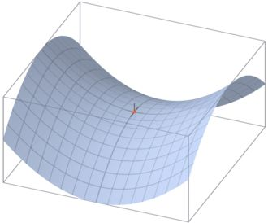

## 李宏毅机器学习Day4-7：线性回归任务二

### 模型性能的度量

在监督学习中，已知样本 $(x_1, y_1),(x_2, y_2),...,(x_n, y_n)$，要求拟合出一个模型（函数）$\hat{f}$，其预测值$\hat{f}(x)$与样本实际值$y​$的误差最小。

考虑到样本数据其实是采样，$y$并不是真实值本身，假设真实模型（函数）是$f$，则采样值$y=f(x)+\varepsilon$，其中$\varepsilon$代表噪音，其均值为0，方差为$\sigma^2​$。

拟合函数$\hat{f}$的主要目的是希望它能对新的样本进行预测，所以，拟合出函数$\hat{f}$后，需要在测试集（训练时未见过的数据）上检测其预测值与实际值$y$之间的误差。可以采用平方误差函数（MSE）来度量其拟合的好坏程度，即 $(y-\hat{f}(x))^2​$。

### 误差来自哪里？

当我们的模型表现不佳时，通常是出现两种问题，一种是高**偏差**问题，另一种是**高方差**问题。

分析发现，其误差的期望值可以分解为三个部分：样本**噪音**、模型预测值的**方差**、预测值相对真实值的**偏差**。

偏差和方差一般称为bias和variance。如果偏差较大，方差较小，此时一般称为**欠拟合**，而偏差较小，方差较大称为**过拟合**。如图：


过拟合说明模型过于复杂，欠拟合说明模型过于简单。

#### 偏差

描述模型输出结果的期望与样本真实结果的差距。 

#### 方差

度量同样大小的训练集的变动所导致的学习性能的变化,刻画了数据扰动所造成的影响。可以理解为方差描述的是预测值的变化范围，离散程度，也就是离其期望值的距离，方差越大，数据的分布越分散。

#### 噪声

噪声表达了当前任务上任何学习算法所能达到的期望泛化误差的下界，刻画了学习问题本身的难度。

### 误差的期望值公式推导

方差的定义和计算：

$Var[X]=E[X^2]−(E[X])^2$

噪音的相关公式：

$y=f+ \varepsilon ​$

$E[\varepsilon]=0​$

$Var[\varepsilon]=\sigma2$

真实模型的期望值：

$E[f]=f​$

由上面公式，可得测试样本的期望值：

$E[y] = E[f+\varepsilon] = E[f] = f$

预测样本$y​$的方差：
$$
\begin{aligned}  
Var[y]=E[(y−E[y])^2] \\
=E[(y−f)^2] \\
=E[(f+ε−f)^2] \\
=E[ε^2] \\
=Var[ε]+(E[ε])^2 \\
=σ2 \\
\end{aligned}
$$

最后得误差的期望：

$E[(y−\hat f)^2] = σ2+Var[\hat f]+(f−E[\hat f])^2 ​$

最后得到的三个项分别是：噪音的方差、模型预测值的方差、预测值相对真实值的偏差的平方。

### 偏差-方差权衡

偏差一方差分解说明，泛化性能是由学习算法的能力、数据的充分性以及学习任务本身的难度所共同决定的。

给定学习任务，为了取得好的泛化性能，则需使偏差较小（能够充分拟合数据），并且使方差较小（使得数据扰动

产生的影响小）。

理想中，我们希望得到一个偏差和方差都很小的模型（第一个图左上），但实际上往往很困难。

增加模型的复杂度通常会增加其方差并减少其偏差。相反，降低模型的复杂度会增加其偏差并降低其方差。

#### bias大，Underfitting

此时应该重新设计model。因为之前的函数集里面可能根本没有包含${\hat f}$。可以考虑将更多的feature加进去，或者使用更复杂的model。 如果此时强行再收集更多的data去训练，这是没有什么帮助的，因为设计的函数集本身就不好，再找更多的训练集也不会更好。

其他常用方法：

- 添加新的特征
- 增加模型复杂度
- 减小正则化系数

#### variance大，Overfitting

- 更多的数据
- 增加正则项
- 降低模型复杂度
- 集成学习方法

偏差和方差并不能够真正的被计算，因为我们不知道数据的真实分布。

但通过Bias-Variance Tradeoff能够让我们更好地认识模型的复杂度，指导我们对模型的改进方向。

以下是改进策略：

>1. [高方差] 采集更多的样本数据
>2. [高方差] 减少特征数量，去除非主要的特征
>3. [高偏差] 引入更多的相关特征
>4. [高偏差] 采用多项式特征
>5. [高偏差] 减小正则化参数 λ
>6. [高方差] 增加正则化参数 λ

### 模型选择

#### 简单交叉验证（Hold-Out CrossValidation）

从全部的训练数据S中随机选择 中随机选择s的样例作为训练集 train，剩余的作为测试集test。

通过对测试集训练 ，得到假设函数或者模型。选择误差最下的模型或者假设。

#### K-Fold 交叉验证

将数据集 D 划分成 k 分互斥的数据子集，每个数据子集的个数基本相近、数据分布基本一致；然后每次用一份数据子集作为测试集，其余的 k-1 份数据子集作为训练集，迭代 k 轮得到 k 个模型，最后将将 k 次的评估结果汇总求平均值得到最终的评估结果。

#### 留一法 (Leave-One-Out CrossValidation)

留一法就是每次只留下一个样本做测试集，其它样本做训练集，如果有k个样本，则需要训练k次，测试k次。

留一发计算最繁琐，但样本利用率最高。适合于小样本的情况。

#### 自助法Bootstrap

以自主采样（bootstrap sampling）为基础，使用有放回的重复采样的方式进行训练集、测试集的构建。比如为了构建 m 条样本的训练集，每次从数据集 D 中采样放入训练集，然后有放回重新采样，重复 m 次得到 m 条样本的训练集，然后将将没有出现过的样本作为测试集。该方法不会减小训练集的规模，同样适合于小样本的情况。因为自助法产生的数据集改变了初始数据集的分布，这会引入估计偏差。

#### 鞍点 

以二维来说，鞍点在x轴方向曲线向上、该点位置导数为0；在y轴方向曲线向下、该点位置导数也为0；但是鞍点既不是局部最优值也不是全局最优值。一般来说，当两个等高线圈圈相交叉的地点，就是鞍点。减少损失的难度也来自于误差曲面中的鞍点，而不是全局最优点。



- 在训练较大的神经网络、存在大量参数，并且成本函数被定义在较高的维度空间时，困在极差的局部最优基本不会发生。
- 鞍点附近的平稳段会非常缓慢，而这也是需要后面的动量梯度下降法，RMSProp以及Adam优化算法能够加速学习的原因，它们能帮助尽快走出平稳段。

### 梯度下降

**批量梯度下降(Batch Gradient Descent)**：每次选择所有样本来对模型参数进行更新。

优点：噪音少一些，幅度大一些。

缺点：每次对整个训练集进行处理，那么数量集很大的时候耗费时间就会比较长。

**随机梯度下降(Stochastic gradient descent)**: 每次选择一个训练样本来对模型参数进行更新。

优点：对每一个样本执行一次梯度下降，执行速度快。

缺点：会有很多噪音，损失函数总体趋势向全局最小靠近，但永远不会收敛。

**小批量梯度下降(Mini-Batch Gradient Descent)**: 每次选择m<M个样本数据来对模型参数进行更新。

介于全批量梯度下降和随机梯度下降法之间。

##### BGD和MBGD代码实现

```python
"""
    实现 SGD 和 mini-batch
"""
import numpy as np
import matplotlib.pyplot as plt

class LinearRegressionGD():
    def __init__(self, lr=0.0001, epochs=100):
        self.lr = lr
        self.epochs = epochs

    def forward(self, x):
        """
            预测模型
        """
        return np.dot(x, self.w.T) + self.b

    def SGD(self, x, y):
        """ 随机梯度下降
        """
        self.w = np.zeros((1, x.shape[1]))
        self.b = np.zeros((1, 1))
        self.cost = []
        for j in range(self.epochs):
            for i in range(x.shape[0]):
                y_hat = self.forward(x[i])
                error = y_hat - y[i]
                self.w -= self.lr * error * x[i]
                self.b -= self.lr * error
                J = 1.0 / 2 * (np.sum(np.square(error)))
                self.cost.append(J)
        return self.w, self.b, self.cost

    def miniBatch(self, x, y, batch_size=20):
        """
            小批量梯度下降
            这里每次随机获取batch_size个样本
            下次获取的数据集不变是不严谨的
        """
        self.w = np.zeros((1, x.shape[1]))
        self.b = np.zeros((1, 1))
        self.cost = []
        num = max(x.shape[0] // batch_size, 1)
        print(num)
        for i in range(self.epochs):
            # 将总样本划分成num个mini-batch
            for j in range(num):
                # 随机选取样本更新参数
                choose = np.random.choice(x.shape[0], batch_size, replace=False)
                x_ = x[choose]
                y_hat = self.forward(x_)
                error = y_hat - y[choose]
                self.w -= self.lr * np.dot(x_.T, error)
                self.b -= self.lr * error.sum()
                J = 1.0 / (2 * batch_size) * (np.sum(np.square(error)))
                self.cost.append(J)
        return self.w, self.b, self.cost

X = np.linspace(0, 10, 100).reshape(100,1)
y = 1+2*X + np.random.normal(0,0.5,(100,1))

gd = LinearRegressionGD(epochs=1000)
# w, b, cost = gd.miniBatch(X, y, batch_size=30)
w, b, cost= gd.SGD(X, y)
h = b + w*X
print(w, b, cost[-1])

plt.title("simple linear regression")
plt.scatter(X, y, color='black')
plt.plot(X, h, color='blue')
plt.xlabel('x')
plt.ylabel('y')
plt.show()
```

#### 特征归一化

我们可以通过使每个输入值在大致相同的范围内来加速梯度下降。这是因为θ将在小范围内快速下降并且在大范围内缓慢下降，因此当变量非常不均匀时，将无法效地振荡到最佳值。防止这种情况的方法是修改输入变量的范围，使它们大致相同，这就是我们说的**归一化**。实现归一化的方法有几种，可以参考文章-[无量纲处理](../../notes/无量纲处理.md)。

### 模型评估

#### MSE

MSE(mean squared Error)，平均平方误差，为所有样本误差(真实值与预测值之差)的平方和，然后取均值

$MSE=\frac{1}{m}\sum_{i=1}^{m}  (y^i-\hat{y}^i)^2$

#### RMSE

RMSE(Root mean squared Error)，平均平方误差的平方根，即在MSE的基础上，取平方根。

### MAE

MAE（Mean Absolute Error），平均绝对值误差，为所有样本误差的绝对值和。

MAE = $\frac{1}{m}\sum_{i=1}^{m}|y^{(i)}-\hat{y}^{(i)}|$

### $R^2$

$R ^ {2}​$为决定系数，用来表示模型拟合性的分值，值越高表示模型拟合性越好，最高为1，可能为负值。
$R ^ {2}​$的计算公式为1减去RSS与TSS的商。其中，TSS（Total Sum of Squares）为所有样本与均值的差异，是方差的m倍。而RSS（Residual sum of squares）为所有样本误差的平方和，是MSE的m倍。

------

参考：

[偏差(Bias)和方差(Variance)——机器学习中的模型选择](https://segmentfault.com/a/1190000016447144)

