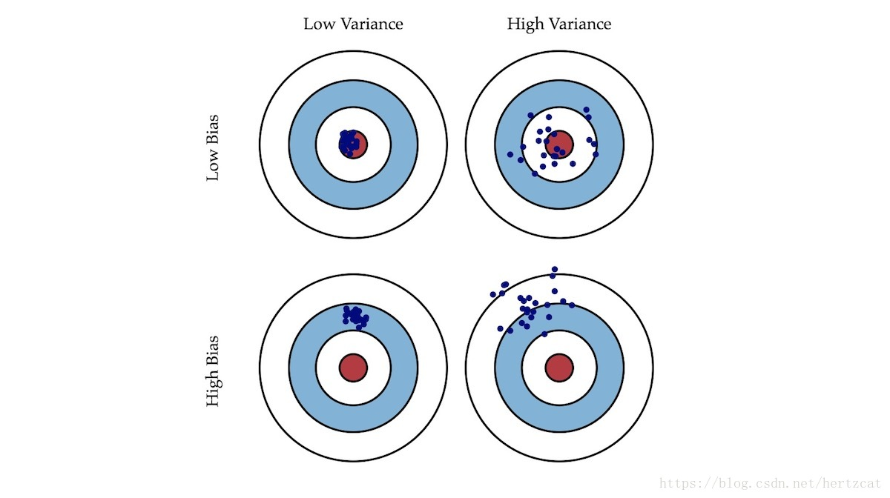

## 李宏毅机器学习Day4-7：线性回归任务二

### 模型性能的度量

在监督学习中，已知样本 $(x_1, y_1),(x_2, y_2),...,(x_n, y_n)$，要求拟合出一个模型（函数）$\hat{f}$，其预测值$\hat{f}(x)$与样本实际值$y$的误差最小。

考虑到样本数据其实是采样，$y$并不是真实值本身，假设真实模型（函数）是$f$，则采样值$y=f(x)+\varepsilon$，其中$\varepsilon$代表噪音，其均值为0，方差为$\sigma^2​$。

拟合函数$\hat{f}​$的主要目的是希望它能对新的样本进行预测，所以，拟合出函数$\hat{f}​$后，需要在测试集（训练时未见过的数据）上检测其预测值与实际值$y​$之间的误差。可以采用平方误差函数（MSE）来度量其拟合的好坏程度，即 $(y-\hat{f}(x))^2​$。

### 误差来自哪里？

当我们的模型表现不佳时，通常是出现两种问题，一种是高**偏差**问题，另一种是**高方差**问题。

分析发现，其误差的期望值可以分解为三个部分：样本**噪音**、模型预测值的**方差**、预测值相对真实值的**偏差**。

偏差和方差一般称为bias和variance。如果偏差较大，方差较小，此时一般称为**欠拟合**，而偏差较小，方差较大称为**过拟合**。如图：

过拟合说明模型过于复杂，欠拟合说明模型过于简单。

#### 偏差

描述模型输出结果的期望与样本真实结果的差距。 

#### 方差

度量同样大小的训练集的变动所导致的学习性能的变化,刻画了数据扰动所造成的影响。可以理解为方差描述的是预测值的变化范围，离散程度，也就是离其期望值的距离，方差越大，数据的分布越分散。

#### 噪声

噪声表达了当前任务上任何学习算法所能达到的期望泛化误差的下界，刻画了学习问题本身的难度。

### 误差的期望值公式推导

方差的定义和计算：

$Var[X]=E[X^2]−(E[X])^2$

噪音的相关公式：

$y=f+ \varepsilon ​$

$E[\varepsilon]=0​$

$Var[\varepsilon]=\sigma2$

真实模型的期望值：

$E[f]=f​$

由上面公式，可得测试样本的期望值：

$E[y] = E[f+\varepsilon] = E[f] = f$

预测样本$y​$的方差：
$$
\begin{aligned}  
Var[y]=E[(y−E[y])^2] \\
=E[(y−f)^2] \\
=E[(f+ε−f)^2] \\
=E[ε^2] \\
=Var[ε]+(E[ε])^2 \\
=σ2 \\
\end{aligned}
$$

最后得误差的期望：

$E[(y−\hat f)^2] = σ2+Var[\hat f]+(f−E[\hat f])^2 ​$

最后得到的三个项分别是：噪音的方差、模型预测值的方差、预测值相对真实值的偏差的平方。

### 偏差-方差权衡

偏差一方差分解说明，泛化性能是由学习算法的能力、数据的充分性以及学习任务本身的难度所共同决定的。

给定学习任务，为了取得好的泛化性能，则需使偏差较小（能够充分拟合数据），并且使方差较小（使得数据扰动

产生的影响小）。

理想中，我们希望得到一个偏差和方差都很小的模型（第一个图左上），但实际上往往很困难。

增加模型的复杂度通常会增加其方差并减少其偏差。相反，降低模型的复杂度会增加其偏差并降低其方差。

#### bias大，Underfitting

此时应该重新设计model。因为之前的函数集里面可能根本没有包含${\hat f}$。可以考虑将更多的feature加进去，或者使用更复杂的model。 如果此时强行再收集更多的data去训练，这是没有什么帮助的，因为设计的函数集本身就不好，再找更多的训练集也不会更好。

#### variance大，Overfitting

- 更多的数据
- 增加正则项

偏差和方差并不能够真正的被计算，因为我们不知道数据的真实分布。

但通过Bias-Variance Tradeoff能够让我们更好地认识模型的复杂度，指导我们对模型的改进方向。

以下是改进策略：

>1. [高方差] 采集更多的样本数据
>2. [高方差] 减少特征数量，去除非主要的特征
>3. [高偏差] 引入更多的相关特征
>4. [高偏差] 采用多项式特征
>5. [高偏差] 减小正则化参数 λ
>6. [高方差] 增加正则化参数 λ

### 模型评估

#### K-Fold 交叉验证

将数据集 D 划分成 k 分互斥的数据子集，每个数据子集的个数基本相近、数据分布基本一致；然后每次用一份数据子集作为测试集，其余的 k-1 份数据子集作为训练集，迭代 k 轮得到 k 个模型，最后将将 k 次的评估结果汇总求平均值得到最终的评估结果。

#### 自助法Bootstrapping

------

参考：

[偏差(Bias)和方差(Variance)——机器学习中的模型选择](https://segmentfault.com/a/1190000016447144)

