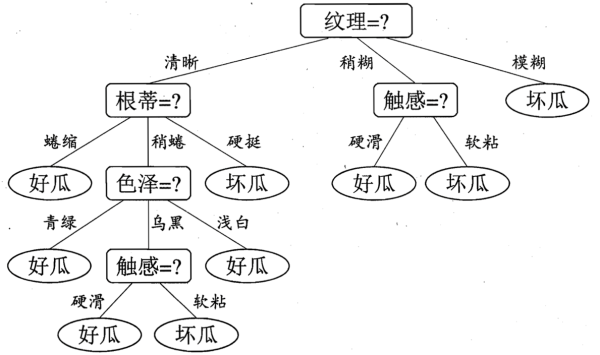

## 决策树

决策树是一种常见的机器学习方法，它基于二元划分策略（类似于二叉树），如下图所示

一棵决策树包括一个根节点、若干个内部节点和若干个叶节点。叶节点对应决策的结果，而其他节点对应一个属性测试。决策树学习的目的就是构建一棵泛化能力强的决策树。决策树算法的优点包括：

- 算法比较简单。
- 理论易于理解。
- 对噪声数据有很好的健壮性。

### 决策树学习的关键

如何选择最优划分属性是决策树学习的关键。

#### 信息熵

信息熵是度量样本纯度的一种常用指标，代表随机变量的复杂度，其越小则纯度越高。定义如下：
$$
Ent(D)=−\sum_\limits{k=1}^yp_klog_2p_k
$$

#### 信息增益

条件熵代表在某一个条件下，随机变量的复杂度（不确定度）。

信息增益=信息熵-条件熵，代表了在一个条件下，信息复杂度（不确定性）减少的程度。

#### ID3算法

以信息增益为准选择决策树的属性

#### C4.5算法

信息增益准则对可取值数目较多的属性有所偏好，所有C4.5算法不直接信用信息增益，而是使用**增益率**，其定义如下：
$$
Gain_ratio(D, a) = \frac{Gain(D,a)}{IV(a)},
IV(a) = - \sum^V{v=1}\frac{|D^v|}{D} log_2\frac{|D^v|}{D}
$$

#### CART算法

使用**基尼指数**划分属性，定义如下：
$$
Gini{index}= \sum^V_\limits{v=1} \frac{|D^v|}{D} Gini(D^v)，而
Gini(D)= 1- \sum^y_{k=1} p_k^2
$$
$Gini(D)$反映了从数据集$D$中随机抽取两个样本，其类别标记不一致的概率。因此$Gini(D)$越小，则数据集$D$的纯度越高。

### 剪枝

- 预剪枝：在构造决策树的同时进行剪枝，对每个节点进行划分前的估计，如果不能带来决策树泛化性能的提升则停止划分并将当前节点标记为叶节点。预剪枝有带来欠拟合的风险。
- 后剪枝：决策树构造完成后进行剪枝，自底向上对非叶节点考察，如果该节点的子树替换为子树的叶节点可以提升泛化性能，则替换该子树为其叶节点。后剪纸的欠拟合风险很小，泛化性能通常优于预剪枝，但计算量大，训练时间较长。

