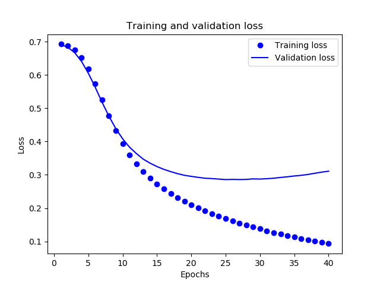
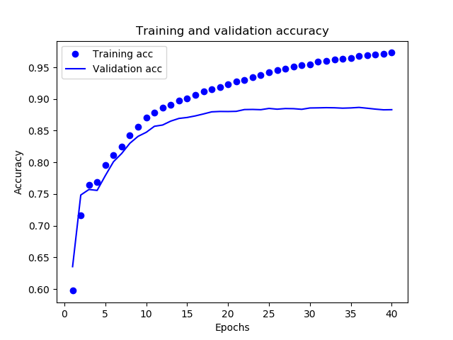
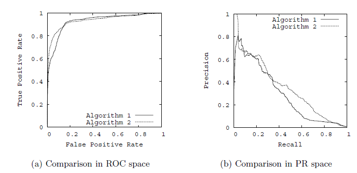
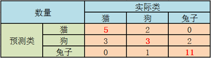

## NLP理论实践DAY1-3

### TensorFlow

#### 基本使用

使用 TensorFlow, 你必须明白 TensorFlow:

- 使用图 (graph) 来表示计算任务.
- 在被称之为 `会话 (Session)` 的上下文 (context) 中执行图.
- 使用 tensor 表示数据.
- 通过 `变量 (Variable)` 维护状态.
- 使用 feed 和 fetch 可以为任意的操作(arbitrary operation) 赋值或者从其中获取数据.

#### 综述

TensorFlow 是一个编程系统, 使用图来表示计算任务. 图中的节点被称之为 *op* (operation 的缩写). 一个 op 获得 0 个或多个 `Tensor`, 执行计算, 产生 0 个或多个 `Tensor`. 每个 Tensor 是一个类型化的多维数组. 例如, 你可以将一小组图像集表示为一个四维浮点数数组, 这四个维度分别是 `[batch, height, width, channels]`.

一个 TensorFlow 图*描述*了计算的过程. 为了进行计算, 图必须在 `会话` 里被启动. `会话` 将图的 op 分发到诸如 CPU 或 GPU 之类的 `设备` 上, 同时提供执行 op 的方法. 这些方法执行后, 将产生的 tensor 返回. 在 Python 语言中, 返回的 tensor 是 numpy `ndarray` 对象; 在 C 和 C++ 语言中, 返回的 tensor 是`tensorflow::Tensor` 实例.

#### 构建图

构建图的第一步, 是创建源 op (source op). 源 op 不需要任何输入, 例如 `常量 (Constant)`. 源 op 的输出被传递给其它 op 做运算.

Python 库中, op 构造器的返回值代表被构造出的 op 的输出, 这些返回值可以传递给其它 op 构造器作为输入.

TensorFlow Python 库有一个*默认图 (default graph)*, op 构造器可以为其增加节点. 这个默认图对 许多程序来说已经足够用了

```python
import tensorflow as tf

# 创建一个常量 op, 产生一个 1x2 矩阵. 这个 op 被作为一个节点
# 加到默认图中.
#
# 构造器的返回值代表该常量 op 的返回值.
matrix1 = tf.constant([[3., 3.]])

# 创建另外一个常量 op, 产生一个 2x1 矩阵.
matrix2 = tf.constant([[2.],[2.]])

# 创建一个矩阵乘法 matmul op , 把 'matrix1' 和 'matrix2' 作为输入.
# 返回值 'product' 代表矩阵乘法的结果.
product = tf.matmul(matrix1, matrix2)
```

默认图现在有三个节点, 两个 `constant()` op, 和一个`matmul()` op. 为了真正进行矩阵相乘运算, 并得到矩阵乘法的 结果, 你必须在会话里启动这个图。这时候直接使用 `print(product)`，得到结果如下：

```python
Tensor("MatMul:0", shape=(1, 1), dtype=float32)
```

#### 启动图

构造阶段完成后, 才能启动图. 启动图的第一步是创建一个 `Session` 对象, 如果无任何创建参数, 会话构造器将启动默认图.

```python
# 启动默认图.
sess = tf.Session()

# 调用 sess 的 'run()' 方法来执行矩阵乘法 op, 传入 'product' 作为该方法的参数.
# 上面提到, 'product' 代表了矩阵乘法 op 的输出, 传入它是向方法表明, 我们希望取回
# 矩阵乘法 op 的输出.
#
# 整个执行过程是自动化的, 会话负责传递 op 所需的全部输入. op 通常是并发执行的.
#
# 函数调用 'run(product)' 触发了图中三个 op (两个常量 op 和一个矩阵乘法 op) 的执行.
#
# 返回值 'result' 是一个 numpy `ndarray` 对象.
result = sess.run(product)
print(result)
# ==> [[ 12.]]
# 任务完成, 关闭会话.
sess.close()
```

在实现上, TensorFlow 将图形定义转换成分布式执行的操作, 以充分利用可用的计算资源(如 CPU 或 GPU). 一般你不需要显式指定使用 CPU 还是 GPU, TensorFlow 能自动检测. 如果检测到 GPU, TensorFlow 会尽可能地利用找到的第一个 GPU 来执行操作.

如果机器上有超过一个可用的 GPU, 除第一个外的其它 GPU 默认是不参与计算的. 为了让 TensorFlow 使用这些 GPU, 你必须将 op 明确指派给它们执行. `with...Device` 语句用来指派特定的 CPU 或 GPU 执行操作:

```python
with tf.Session() as sess:
  with tf.device("/gpu:1"):
    matrix1 = tf.constant([[3., 3.]])
    matrix2 = tf.constant([[2.],[2.]])
    product = tf.matmul(matrix1, matrix2)
    ...
```

#### Tensor

TensorFlow 程序使用 tensor 数据结构来代表所有的数据, 计算图中, 操作间传递的数据都是 tensor. 你可以把 TensorFlow tensor 看作是一个 n 维的数组或列表. 一个 tensor 包含一个静态类型 rank, 和 一个 shape.

#### 变量

变量维护图执行过程中的状态信息. 下面的例子演示了如何使用变量实现一个简单的计数器.

```python
# 创建一个变量, 初始化为标量 0.
state = tf.Variable(0, name="counter")

# 创建一个 op, 其作用是使 state 增加 1

one = tf.constant(1)
new_value = tf.add(state, one)
update = tf.assign(state, new_value)

# 启动图后, 变量必须先经过`初始化` (init) op 初始化,
# 首先必须增加一个`初始化` op 到图中.
init_op = tf.initialize_all_variables()

# 启动图, 运行 op
with tf.Session() as sess:
  # 运行 'init' op
  sess.run(init_op)
  # 打印 'state' 的初始值
  print(sess.run(state))
  # 运行 op, 更新 'state', 并打印 'state'
  for _ in range(3):
    sess.run(update)
    print(sess.run(state))

# 输出:
# 0
# 1
# 2
# 3
```

代码中 `assign()` 操作是图所描绘的表达式的一部分, 正如 `add()` 操作一样. 所以在调用 `run()` 执行表达式之前, 它并不会真正执行赋值操作.

#### Fetch

为了取回操作的输出内容, 可以在使用 `Session` 对象的 `run()` 调用 执行图时, 传入一些 tensor, 这些 tensor 会帮助你取回结果. 在之前的例子里, 我们只取回了单个节点 `state`, 但是你也可以取回多个 tensor

```python
input1 = tf.constant(3.0)
input2 = tf.constant(2.0)
input3 = tf.constant(5.0)
intermed = tf.add(input2, input3)
mul = tf.multiply(input1, intermed)

with tf.Session() as sess:
  result = sess.run([mul, intermed])
  print(result)

# 输出:
# [21.0, 7.0]
```

#### Feed

TensorFlow 还提供了 feed 机制, 该机制 可以临时替代图中的任意操作中的 tensor 可以对图中任何操作提交补丁, 直接插入一个 tensor.

feed 使用一个 tensor 值临时替换一个操作的输出结果. 你可以提供 feed 数据作为 `run()` 调用的参数. feed 只在调用它的方法内有效, 方法结束, feed 就会消失. 最常见的用例是将某些特殊的操作指定为 "feed" 操作, 标记的方法是使用 tf.placeholder() 为这些操作创建占位符.

```python
input1 = tf.placeholder(tf.float32)
input2 = tf.placeholder(tf.float32)
output = tf.multiply(input1, input2)

with tf.Session() as sess:
  print(sess.run([output], feed_dict={input1:[7.], input2:[2.]}))

# 输出:
# [array([ 14.], dtype=float32)]
```

### IMDB影评文本分类

#### IMDB数据集

该数据集包含来自互联网电影数据库的 50000 条影评文本。我们将这些影评拆分为训练集（25000 条影评）和测试集（25000 条影评）。我们将使用keras来对影评进行文本分类。这里我用的tensorflow版本(1.13.1)已经内置了keras库。

下载IMDB数据集：

```python
from tensorflow import keras
imdb = keras.datasets.imdb
(train_data, train_labels), (test_data, test_labels) = imdb.load_data(num_words=10000)
```

如果出现下载失败的情况，需要离线下载imdb，这时代码修改如下：

```python
(train_data, train_labels), (test_data, test_labels) = imdb.load_data(path="./dataset/imdb.npz", num_words=10000)
```

注释掉imdb.py中如下几行 ：

```
  # path = get_file(
  #     path,
  #     origin=origin_folder + 'imdb.npz',
  #     file_hash='599dadb1135973df5b59232a0e9a887c')
```

#### 准备数据

影评（整数数组）必须转换为张量，然后才能馈送到神经网络中。

由于影评的长度必须相同，我们将使用 pad_sequences函数将长度标准化。

```python
train_data = keras.preprocessing.sequence.pad_sequences(train_data,
                                                        value=word_index["<PAD>"],
                                                        padding='post',
                                                        maxlen=256)

test_data = keras.preprocessing.sequence.pad_sequences(test_data,
                                                       value=word_index["<PAD>"],
                                                       padding='post',
                                                       maxlen=256)
```

#### 构建模型

在本示例中，输入数据由字词-索引数组构成。要预测的标签是 0 或 1。

```python
vocab_size = 10000
model = keras.Sequential()
model.add(keras.layers.Embedding(vocab_size, 16))
model.add(keras.layers.GlobalAveragePooling1D())
model.add(keras.layers.Dense(16, activation=tf.nn.relu))
model.add(keras.layers.Dense(1, activation=tf.nn.sigmoid))
```

按顺序堆叠各个层以构建分类器：

1. 第一层是 `Embedding` 层。该层会在整数编码的词汇表中查找每个字词-索引的嵌入向量。模型在接受训练时会学习这些向量。这些向量会向输出数组添加一个维度。生成的维度为：`(batch, sequence, embedding)`。
2. 接下来，一个 `GlobalAveragePooling1D` 层通过对序列维度求平均值，针对每个样本返回一个长度固定的输出向量。这样，模型便能够以尽可能简单的方式处理各种长度的输入。
3. 该长度固定的输出向量会传入一个全连接 (`Dense`) 层（包含 16 个隐藏单元）。
4. 最后一层与单个输出节点密集连接。应用 `sigmoid` 激活函数后，结果是介于 0 到 1 之间的浮点值，表示概率或置信水平。

#### 损失函数

我们将使用 `binary_crossentropy` 损失函数。

该函数并不是唯一的损失函数，例如，您可以选择 `mean_squared_error`。但一般来说，`binary_crossentropy` 更适合处理概率问题，它可测量概率分布之间的“差距”，在本例中则为实际分布和预测之间的“差距”。

```python
model.compile(optimizer=tf.train.AdamOptimizer(),
              loss='binary_crossentropy',
              metrics=['accuracy'])
```

#### 创建验证集

在训练时，我们需要检查模型处理从未见过的数据的准确率。我们从原始训练数据中分离出 10000 个样本，创建一个验证集。

```python
x_val = train_data[:10000]
partial_x_train = train_data[10000:]

y_val = train_labels[:10000]
partial_y_train = train_labels[10000:]
```

#### 训练模型

用有 512 个样本的小批次训练模型 40 个周期。这将对 x_train 和 y_train 张量中的所有样本进行 40 次迭代。在训练期间，监控模型在验证集的 10000 个样本上的损失和准确率：

```python
history = model.fit(partial_x_train,
                    partial_y_train,
                    epochs=40,
                    batch_size=512,
                    validation_data=(x_val, y_val),
                    verbose=1)
```

#### 评估模型

我们来看看模型的表现如何。模型会返回两个值：损失（表示误差的数字，越低越好）和准确率。

```python
results = model.evaluate(test_data, test_labels)
print(results) # [0.3244608826637268, 0.87292]
```

#### 可视化结果

##### 损失比较

```python
import matplotlib.pyplot as plt

acc = history.history['acc']
val_acc = history.history['val_acc']
loss = history.history['loss']
val_loss = history.history['val_loss']

epochs = range(1, len(acc) + 1)

# "bo" is for "blue dot"
plt.plot(epochs, loss, 'bo', label='Training loss')
# b is for "solid blue line"
plt.plot(epochs, val_loss, 'b', label='Validation loss')
plt.title('Training and validation loss')
plt.xlabel('Epochs')
plt.ylabel('Loss')
plt.legend()
plt.show()
```



##### 准确率比较

```python
acc_values = history.history['acc']
val_acc_values = history.history['val_acc']
plt.plot(epochs, acc, 'bo', label='Training acc')
plt.plot(epochs, val_acc, 'b', label='Validation acc')
plt.title('Training and validation accuracy')
plt.xlabel('Epochs')
plt.ylabel('Accuracy')
plt.legend()
plt.show()
```



### CNN中文文本分类

参考链接：

<https://blog.csdn.net/u011439796/article/details/77692621>

### 分类模型评估

我们将算法预测的结果分成四种情况：

1. **正确肯定**（**True Positive,TP**）：预测为真，实际为真， 真阳性。
2. **正确否定**（**True Negative,TN**）：预测为假，实际为假，真阴性。
3. **错误肯定**（**False Positive,FP**）：预测为真，实际为假，假阳性。
4. **错误否定**（**False Negative,FN**）：预测为假，实际为真，假阴性。

#### 准确率(Accuracy)

测试样本中正确分类的样本数占总测试的样本数的比例。

**ACC=(TP+TN)/(TP+TN+FN+FP)**

#### 精确率(查准率，Precision)

**P=TP/(TP+FP)**

例，在所有我们预测有恶性肿瘤的病人中，实际上有恶性肿瘤的病人的百分比，越高越好。

#### 召回率(查全率，Recall)

**R=TP/(TP+FN)**

例，在所有实际上有恶性肿瘤的病人中，成功预测有恶性肿瘤的病人的百分比，越高越好。

#### 特异性

**S=FP/(FP+TN)**

#### F1值

我们用F1值来综合评估精确率和召回率，它是精确率和召回率的调和均值。

$F_1Score=2\frac{PR}{P+R}$

#### ROC曲线

以召回率为y轴，以特异性为x轴，我们就直接得到了RoC曲线。从召回率和特异性的定义可以理解，召回率越高，特异性越小，我们的模型和算法就越高效。也就是画出来的RoC曲线越靠近左上越好。

#### AUC值

从几何的角度讲，RoC曲线下方的面积越大越大，则模型越优。所以有时候我们用RoC曲线下的面积，即AUC（Area Under Curve）值来作为算法和模型好坏的标准。

#### PR曲线

以精确率为y轴，以召回率为x轴，我们就得到了PR曲线。仍然从精确率和召回率的定义可以理解，精确率越高，召回率越高，我们的模型和算法就越高效。也就是画出来的PR曲线越靠近右上越好。



#### 混淆矩阵

混淆矩阵，也称为误差矩阵，是一种特定的表格布局，允许可视化算法的性能， 矩阵的每一行代表预测类中的实例，而每列代表实际类中的实例，“混淆”一词源于这样一个事实：它可以很容易地看出系统是否混淆了两个类。

如果分类系统已经过训练以区分猫，狗和兔子，则混淆矩阵将总结测试算法的结果以供进一步检查。假设有27只动物的样本：8只猫，6只狗和13只兔子，产生的混淆矩阵如下表所示：



在这个混淆矩阵中，在8只实际的猫中，系统预测三只是狗，而在六只狗中，它预测一只是一只兔子，两只是猫。 我们可以从矩阵中看出，所讨论的系统难以区分猫和狗，但可以很好地区分兔子和其他类型的动物。 所有正确的预测都位于表格的对角线上（以粗体突出显示），因此很容易在视觉上检查表格中的预测错误，因为它们将由对角线外的值表示。

