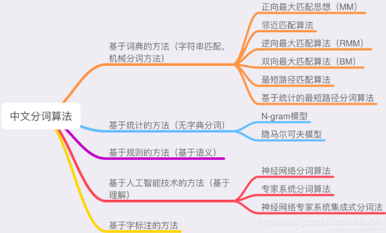

## NLP理论实践DAY4-5 特征提取

### 中文分词概念

中文分词是中文信息处理的基本技术，指将一个汉字序列切分成一个个单独的词。

分词就是将连续的字序列按照一定的规范重新组合成词序列的过程。

**基于字典的分词方法**，它是按照一定策略将待分析的汉字串与一个“充分大的”机器词典中的词条进行匹配，若在词典中找到某个字符串，则匹配成功。根据扫描方向的不同，这种分词方法分为正向匹配、逆向匹配和双向匹配，常见的匹配原则有逐词匹配、最大匹配、最小匹配和最佳匹配。

#### 正向最大匹配法

最大匹配是指以词典为依据，取词典中最长单词为第一个次取字数量的扫描串，在词典中进行扫描（为提升扫描效率，还可以跟据字数多少设计多个字典，然后根据字数分别从不同字典中进行扫描）。例如：词典中最长词为“中华人民共和国”共7个汉字，则最大匹配起始字数为7个汉字。然后逐字递减，在对应的词典中进行查找。

以“我们在野生动物园玩”为例，

正向即从前往后取词，从7->1，每次减一个字，直到词典命中或剩下1个单字。

第1轮扫描
第1次：“我们在野生动物”，扫描7字词典，无
第2次：“我们在野生动”，扫描6字词典，无
。。。。
第6次：“我们”，扫描2字词典，有
扫描中止，输出第1个词为“我们”，去除第1个词后开始第2轮扫描
第2轮扫描：
第1次：“在野生动物园玩”，扫描7字词典，无
第2次：“在野生动物园”，扫描6字词典，无
。。。。
第6次：“在野”，扫描2字词典，有
扫描中止，输出第2个词为“在野”，去除第2个词后开始第3轮扫描
第3轮扫描：
第1次：“生动物园玩”，扫描5字词典，无
第2次：“生动物园”，扫描4字词典，无
第3次：“生动物”，扫描3字词典，无
第4次：“生动”，扫描2字词典，有
扫描中止，输出第3个词为“生动”，第4轮扫描
第4轮扫描：
第1次：“物园玩”，扫描3字词典，无
第2次：“物园”，扫描2字词典，无
第3次：“物”，扫描1字词典，无
扫描中止，输出第4个词为 ‘’物‘’，非字典词数加1，开始第5轮扫描
第5轮扫描：
第1次：“园玩”，扫描2字词典，无
第2次：“园”，扫描1字词典，有
扫描中止，输出第5个词为“园”，单字字典词数加1，开始第6轮扫描
第6轮扫描：
第1次：“玩”，扫描1字字典词，有
扫描中止，输出第6个词为“玩”，单字字典词数加1，整体扫描结束。

正向最大匹配法，最终切分结果为：“我们/在野/生动/物/园/玩”，其中，单字字典词为2，非词典词为1。

#### 逆向最大匹配法

逆向即从后往前取词，从7->1，每次减一个字，直到词典命中或剩下1个单字。即：

第1轮扫描：“在野生动物园玩”
第1次：“在野生动物园玩”，扫描7字词典，无
第2次：“野生动物园玩”，扫描6字词典，无
。。。。
第7次：“玩”，扫描1字词典，有
扫描中止，输出“玩”，单字字典词加1，开始第2轮扫描
第2轮扫描：“们在野生动物园”
第1次：“们在野生动物园”，扫描7字词典，无
第2次：“在野生动物园”，扫描6字词典，无
第3次：“野生动物园”，扫描5字词典，有
扫描中止，输出“野生动物园”，开始第3轮扫描
第3轮扫描：“我们在”
第1次：“我们在”，扫描3字词典，无
第2次：“们在”，扫描2字词典，无
第3次：“在”，扫描1字词典，有
扫描中止，输出“在”，单字字典词加1，开始第4轮扫描
第4轮扫描：“我们”
第1次：“我们”，扫描2字词典，有
扫描中止，输出“我们”，整体扫描结束。

逆向最大匹配法，最终切分结果为：“我们/在/野生动物园/玩”，其中，单字字典词为2，非词典词为0。

#### 双向最大匹配法

正向最大匹配法和逆向最大匹配法，都有其局限性，我举得例子是正向最大匹配法局限性的例子，逆向也同样存在（如：长春药店，逆向切分为“长/春药店”），因此有人又提出了双向最大匹配法，双向最大匹配法。即，两种算法都切一遍，然后根据大颗粒度词越多越好，非词典词和单字词越少越好的原则，选取其中一种分词结果输出。

如：“我们在野生动物园玩”

正向最大匹配法，最终切分结果为：“我们/在野/生动/物/园/玩”，其中，两字词3个，单字字典词为2，非词典词为1。

逆向最大匹配法，最终切分结果为：“我们/在/野生动物园/玩”，其中，五字词1个，两字词1个，单字字典词为2，非词典词为0。

非字典词：正向(1)>逆向(0)（越少越好）

单字字典词：正向(2)=逆向(2)（越少越好）

总词数：正向(6)>逆向(4)（越少越好）

因此最终输出为逆向结果。

### 词、字符频率统计

使用 collections.Counter 进行统计，jieba进行分词。

### unigram、bigram、trigram

为了解决自由参数数目过多的问题，引入了马尔科夫假设：随意一个词出现的概率只与它前面出现的有限的n个词有关。基于上述假设的统计语言模型被称为N-gram语言模型。

从模型的效果来看，理论上n的取值越大，效果越好。但随着n取值的增加，效果提升的幅度是在下降的。同时还涉及到一个可靠性和可区别性的问题，参数越多，可区别性越好，但同时单个参数的实例变少从而降低了可靠性。
其中，有关中文分词的一些概念是我们需要掌握的，譬如：

unigram 一元分词，把句子分成一个一个的汉字，每个词之间没有关联关系；
bigram 二元分词，把句子从头到尾每两个字组成一个词语，当前词只和上一个词有关系；
trigram 三元分词，把句子从头到尾每三个字组成一个词语，当前词只和前两个词有关系。
比如：

大连海事大学：

unigram 形式为：大/连/海/事/大/学

bigram形式为： 大连/连海/海事/事大/大学

trigram形式为：大连海/连海事/海事大事通大学

### 文档向量化

步骤如下：

1. 分词
2. 去停用词
3. 每篇文档的向量化

