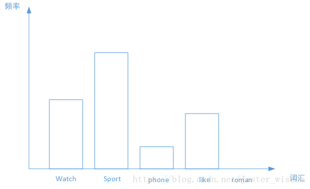

## NLP理论实践DAY6-7 特征选择

### TF-IDF

TF-IDF是Term Frequency -  Inverse Document Frequency的缩写，即“词频-逆文本频率”。它由两部分组成，TF和IDF。

前面的TF也就是我们前面说到的词频，我们之前做的向量化也就是做了文本中各个词的出现频率统计，并作为文本特征，这个很好理解。关键是后面的这个IDF，即“逆文本频率”如何理解。

比如如下几个文本：

```
"I come to China to travel", 
"This is a car polupar in China",          
"I love tea and Apple ",   
"The work is to write some papers in science"
```

不考虑停用词，处理后得到的词向量如下：

```
[[0 0 0 1 1 0 0 0 0 0 0 0 0 0 0 2 1 0 0]
 [0 0 1 1 0 1 1 0 0 1 0 0 0 0 1 0 0 0 0]
 [1 1 0 0 0 0 0 1 0 0 0 0 1 0 0 0 0 0 0]
 [0 0 0 0 0 1 1 0 1 0 1 1 0 1 0 1 0 1 1]]
```

如果我们直接将统计词频后的19维特征做为文本分类的输入，会发现有一些问题。比如第一个文本，我们发现"come","China"和“Travel”各出现1次，而“to“出现了两次。似乎看起来这个文本与”to“这个特征更关系紧密。但是实际上”to“是一个非常普遍的词，几乎所有的文本都会用到，因此虽然它的词频为2，但是重要性却比词频为1的"China"和“Travel”要低的多。如果我们的向量化特征仅仅用词频表示就无法反应这一点。因此我们需要进一步的预处理来反应文本的这个特征，而这个预处理就是TF-IDF。我们的IDF就是来帮助我们来反应这个词的重要性的，进而修正仅仅用词频表示的词特征值。

### Bag-of-words(词袋)



Bag-of-words词袋模型最初被用在信息检索领域，对于一篇文档来说，假定不考虑文档内的词的顺序关系和语法，只考虑该文档是否出现过这个单词。假设有5类主题，我们的任务是来了一篇文档，判断它属于哪个主题。在训练集中，我们有若干篇文档，它们的主题类型是已知的。我们从中选出一些文档，每篇文档内有一些词，我们利用这些词来构建词袋。我们的词袋可以是这种形式：{‘watch’,'sports','phone','like','roman',……}，然后每篇文档都可以转化为以各个单词作为横坐标，以单词出现的次数为纵坐标的直方图，如下图所示，之后再进行归一化，将每个词出现的频数作为文档的特征。

近几年，在图像领域，使用Bag-of-words方法也是取得了较好的结果。如果说文档对应一幅图像的话，那么文档内的词就是一个图像块的特征向量。一篇文档有若干个词构成，同样的，一幅图像由若干个图像块构成，而特征向量是图像块的一种表达方式。我们求得N幅图像中的若干个图像块的特征向量，然后用k-means算法把它们聚成k类，这样我们的词袋里就有k个词，然后来了一幅图像，看它包含哪些词，包含单词A，就把单词A的频数加1。最后归一化，得到这幅图像的BoW表示，假如k=4,每幅图像有8个小块(patch)，那么结果可能是这样的：[2,0,4,2]，归一化之后为[0.25,0,0.5,0.25]。

同样，在语音识别领域，也有Bag-of-words方法也大施了拳脚。假设一段语音信号有2秒长，我们取每帧长40ms,帧移10ms,就可以得到一小段一小段的语音信号，然后提取每一小段上的音频特征，假设这里使用12维MFCC，那么有多少个小段语音信号，就有多少个MFCC特征向量。我们的目标是来一段语音信号，判断它的情感类别。我们的做法是：取一定数量的MFCC特征向量，将它们聚成k个类，那么这里的词袋里的词就是这k个类别。对于一段语音信号，我们对其进行分段之后，将各小段分配到这k个类别上，那么，每个类别上就对应了这一段语音信号里属于该类的段的个数。最后归一化，得到其特征表示。

### 点互信息和互信息

#### 点互信息

机器学习相关文献里面，经常会用到点互信息PMI(Pointwise Mutual Information)这个指标来衡量两个事物之间的相关性（比如两个

词）。

其原理很简单，公式如下：


在概率论中，我们知道，如果x跟y不相关，则p(x,y)=p(x)p(y)。二者相关性越大，则p(x, y)就相比于p(x)p(y)越大。用后面的式子可能更好理解，在y出现的情况下x出现的条件概率p(x|y)除以x本身出现的概率p(x)，自然就表示x跟y的相关程度。

举个自然语言处理中的例子来说，我们想衡量like这个词的极性（正向情感还是负向情感）。我们可以预先挑选一些正向情感的词，比如good。然后我们算like跟good的PMI。

#### 互信息

点互信息PMI其实就是从信息论里面的互信息这个概念里面衍生出来的。  

互信息即：


其衡量的是两个随机变量之间的相关性，即一个随机变量中包含的关于另一个随机变量的信息量。所谓的随机变量，即随机试验结果的量的表示，可以简单理解为按照一个概率分布进行取值的变量，比如随机抽查的一个人的身高就是一个随机变量。可以看出，互信息其实就是对X和Y的所有可能的取值情况的点互信息PMI的加权和。

决策树学习中的信息增益等价于训练数据集中类与特征的互信息。

### 特征选择

#### 过滤（Filter）

过滤法只用于检验特征向量和目标（响应变量）的相关度，不需要任何的机器学习的算法，不依赖于任何模型，只是应用统计量做筛选：我们根据统计量的大小，设置合适的阈值，将低于阈值的特征剔除。

所以，从某种程度上来说，过滤法更像是一个数学问题，我们只在过滤之后的特征子集上进行建模和训练。

过滤法应用于回归问题，还可以采用互信息法（Mutual Information ），应用分类问题则可以使用卡方检验（Chi-Squared Test ）。

#### 包裹（Warpper）

与过滤法不同的是，包裹法采用的是特征搜索的办法。它的基本思路是，从初始特征集合中不断的选择子集合，根据学习器的性能来对子集进行评价，直到选择出最佳的子集。在搜索过程中，我们会对每个子集做建模和训练。

基于此，包裹法很大程度上变成了一个计算机问题：在特征子集的搜索问题（subset search）。我们有多种思路，最容易想到的办法是穷举（Brute-force search），遍历所有可能的子集，但这样的方法适用于特征数较少的情形，特征一旦增多，就会遇到组合爆炸，在计算上并不可行。（N个特征，则子集会有$2^N-1$种可能）

另一个思路是随机化搜索，比如拉斯维加斯算法（Las Vegas algorithm），但这样的算法在特征数大的时候，计算开销仍然很大，而且有给不出任何解的风险。所以，我们常使用的是贪心算法。

**前向搜索（Forward search）**

在开始时，按照特征数来划分子集，每个子集只有一个特征，对每个子集进行评价。然后在最优的子集上逐步增加特征，使模型性能提升最大，直到增加特征并不能使模型性能提升为止。

**后向搜索（Backward search）**

在开始时，将特征集合分别减去一个特征作为子集，每个子集有N—1个特征，对每个子集进行评价。然后在最优的子集上逐步减少特征，使得模型性能提升最大，直到减少特征并不能使模型性能提升为止。

**双向搜索（Bidirectional search）**

将Forward search 和Backward search结合起来。

**递归剔除（Recursive elimination ）**

反复的训练模型，并剔除每次的最优或者最差的特征，将剔除完毕的特征集进入下一轮训练，直到所有的特征被剔除，被剔除的顺序度量了特征的重要程度。

#### 嵌入法（Embedding）

如果仔细思考前两种方法，过滤法与学习器没有关系，特征选择只是用统计量做筛选，而包裹法则固定了学习器，特征选择只是在特征空间上进行搜索。而嵌入法最大的突破在于，特征选择会在学习器的训练过程中自动完成。

比如在回归问题上，我们可以通过降低权重系数的办法来降低过拟合，那么在线性模型中，降低权重系数就意味着与之相关的特征并不重要，实际上就是对特征做了一定的筛选。正则化的方法就是一种标准的嵌入法。

除此之外，决策树也是典型的嵌入法。因为决策树是利用一个特征进行分类，我们在生成决策树的过程就是挑选特征的过程，并且根据特征的不同取值构建子节点，直到特征没有分类能力或者很小，就停止生成节点。

