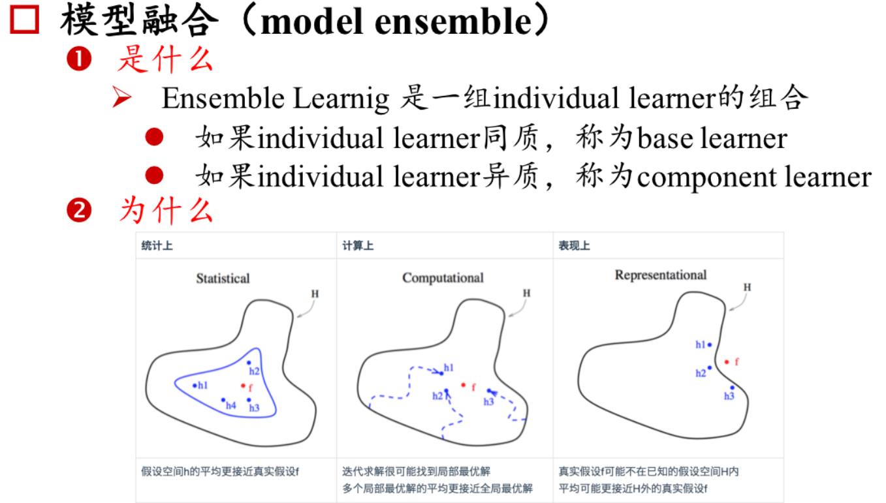
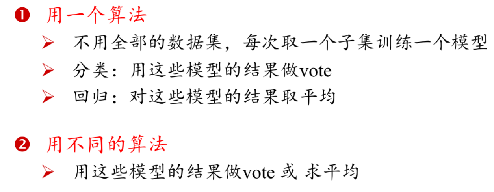
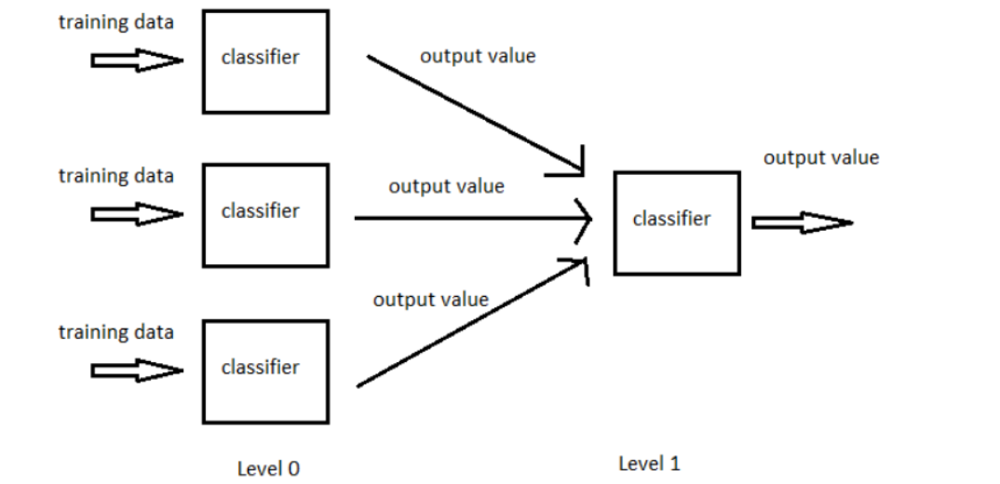
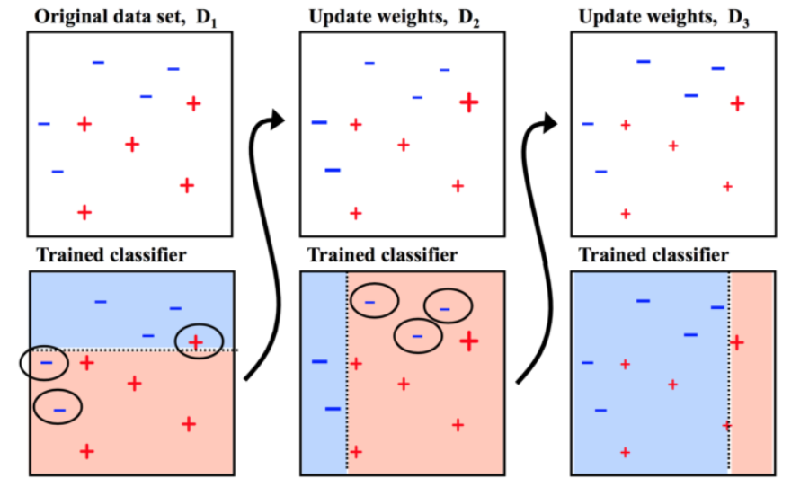
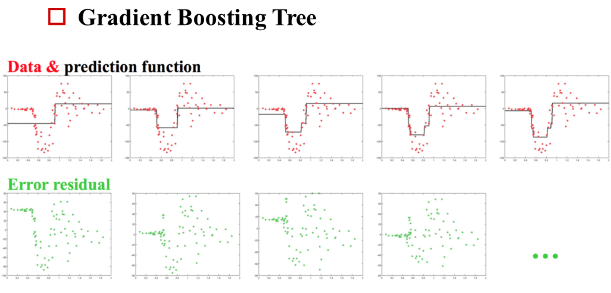
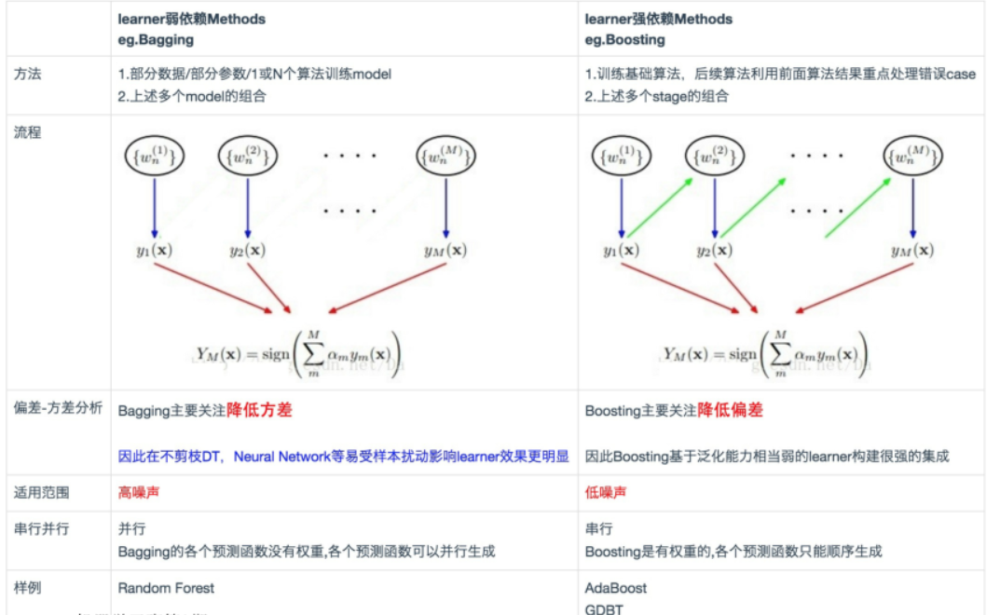

## 模型融合

### 什么是模型融合?

### Bagging

### Stacking

Stacking的思想是一种有层次的融合模型，比如我们将用不同特征训练出来的三个GBDT模型进行融合时，我们会将三个GBDT作为基层模型，在其上在训练一个次学习器（通常为线性模型LR）,用于组织利用基学习器的答案，也就是将基层模型的答案作为输入，让次学习器学习组织给基层模型的答案分配权重。

### Boosting

Boosting 这其实思想相当的简单，大概是，对一份数据，建立 M 个模型（比如分类），一般这种模型比较简单,称为弱分类器。每次分类都将上一次分错的数据权重提高一点再进行分类，这样最终得到的分类器在测试数据与训练数据上都可以得到比较好的成绩。
 

我觉得 Boosting 更像是一个人学习的过程， 开始学一样东西的时候， 会去做一些习题，但是常常连一些简单的题目都会弄错，但是越到后面，简单的题目已经难不倒他了，就会去做更复杂的题目，等到他做了很多的题目后，不管是难题还是简单的题都可以解决掉了。

#### GBDT

### Bagging vs Boosting

