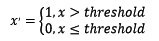

## 特征工程

### 特征工程是什么？

　　有这么一句话在业界广泛流传：数据和特征决定了机器学习的上限，而模型和算法只是逼近这个上限而已。那特征工程到底是什么呢？顾名思义，其本质是一项工程活动，目的是最大限度地从原始数据中提取特征以供算法和模型使用。

特征处理是特征工程的核心部分，sklearn提供了较为完整的特征处理方法，包括数据预处理，特征选择，降维等。


###  数据预处理

　　通过特征提取，我们能得到未经处理的特征，这时的特征可能有以下问题：

- 不属于同一量纲：即特征的规格不一样，不能够放在一起比较。无量纲化可以解决这一问题。
- 信息冗余：对于某些定量特征，其包含的有效信息为区间划分，例如学习成绩，假若只关心“及格”或不“及格”，那么需要将定量的考分，转换成“1”和“0”表示及格和未及格。二值化可以解决这一问题。
- 定性特征不能直接使用：某些机器学习算法和模型只能接受定量特征的输入，那么需要将定性特征转换为定量特征。最简单的方式是为每一种定性值指定一个定量值，但是这种方式过于灵活，增加了调参的工作。通常使用**哑编码**的方式将定性特征转换为定量特征：假设有N种定性值，则将这一个特征扩展为N种特征，当原始特征值为第i种定性值时，第i个扩展特征赋值为1，其他扩展特征赋值为0。哑编码的方式相比直接指定的方式，不用增加调参的工作，对于线性模型来说，使用哑编码后的特征可达到非线性的效果。
- 存在缺失值：缺失值需要补充。
- 信息利用率低：不同的机器学习算法和模型对数据中信息的利用是不同的，之前提到在线性模型中，使用对定性特征哑编码可以达到非线性的效果。类似地，对定量变量多项式化，或者进行其他的转换，都能达到非线性的效果。

　我们使用sklearn中的preproccessing库来进行数据预处理，可以覆盖以上问题的解决方案。

#### [无量纲化](<https://github.com/CrazyXiao/machine-learning/blob/master/notes/%E6%97%A0%E9%87%8F%E7%BA%B2%E5%A4%84%E7%90%86.md>)

#### 对定量特征二值化

定量特征二值化的核心在于设定一个阈值，大于阈值的赋值为1，小于等于阈值的赋值为0，公式表达如下：



使用preproccessing库的Binarizer类对数据进行二值化的代码如下：

```
from sklearn.preprocessing import Binarizer
#二值化，阈值设置为3，返回值为二值化后的数据
Binarizer(threshold=3).fit_transform(iris.data)
```

#### 对定性特征哑编码

```
from sklearn.preprocessing import  OneHotEncoder
enc = OneHotEncoder()
enc.fit([[0, 0, 3],
         [1, 1, 0],
         [0, 2, 1],
         [1, 0, 2]])
ans = enc.transform([[0, 1, 3]]).toarray()  # 如果不加 toarray() 的话，输出的是稀疏的存储格式，即索引加值的形式，也可以通过参数指定 sparse = False 来达到同样的效果
print(ans) # 输出 [[ 1.  0.  0.  1.  0.  0.  0.  0.  1.]]
```

下面解释输出结果的意思。对于输入数组，这依旧是把每一行当作一个样本，每一列当作一个特征，

- 我们先来看第一个特征，即第一列 [0,1,0,1][0,1,0,1]，也就是说它有两个取值 0 或者 1，那么 one-hot 就会使用两位来表示这个特征，[1,0][1,0] 表示 0， [0,1][0,1] 表示 1，在上例输出结果中的前两位 [1,0...][1,0...] 也就是表示该特征为 0
- 第二个特征，第二列 [0,1,2,0][0,1,2,0]，它有三种值，那么 one-hot 就会使用三位来表示这个特征，[1,0,0][1,0,0] 表示 0， [0,1,0][0,1,0] 表示 1，[0,0,1][0,0,1] 表示 2，在上例输出结果中的第三位到第六位 [...0,1,0,0...][...0,1,0,0...] 也就是表示该特征为 1
- 第二个特征，第三列 [3,0,1,2][3,0,1,2]，它有四种值，那么 one-hot 就会使用四位来表示这个特征，[1,0,0,0][1,0,0,0] 表示 0， [0,1,0,0][0,1,0,0] 表示 1，[0,0,1,0][0,0,1,0] 表示 2，[0,0,0,1][0,0,0,1] 表示 3，在上例输出结果中的最后四位 [...0,0,0,1][...0,0,0,1] 也就是表示该特征为 3

好了，到此相信我们已经很明白它的意思了。值得注意的是，虽然训练样本中的数值仅仅代表类别，但是也必须使用数值格式的数据，如果使用字符串格式的数据会报错。

#### 缺失值计算

由于IRIS数据集没有缺失值，故对数据集新增一个样本，4个特征均赋值为NaN，表示数据缺失。使用preproccessing库的Imputer类对数据进行缺失值计算的代码如下：

```
from numpy import vstack, array, nan
from sklearn.preprocessing import Imputer
#缺失值计算，返回值为计算缺失值后的数据
#参数missing_value为缺失值的表示形式，默认为NaN
#参数strategy为缺失值填充方式，默认为mean（均值）
Imputer().fit_transform(vstack((array([nan, nan, nan, nan]), iris.data)))
```

#### 数据变换

常见的数据变换有基于多项式的、基于指数函数的、基于对数函数的。

使用preproccessing库的PolynomialFeatures类对数据进行多项式转换。

基于单变元函数的数据变换可以使用一个统一的方式完成，使用preproccessing库的FunctionTransformer对数据进行对数函数转换。

### 特征选择

当数据预处理完成后，我们需要选择有意义的特征输入机器学习的算法和模型进行训练。通常来说，从两个方面考虑来选择特征：

- 特征是否发散：如果一个特征不发散，例如方差接近于0，也就是说样本在这个特征上基本上没有差异，这个特征对于样本的区分并没有什么用。
- 特征与目标的相关性：这点比较显见，与目标相关性高的特征，应当优选选择。除方差法外，本文介绍的其他方法均从相关性考虑。

根据特征选择的形式又可以将特征选择方法分为3种：

- Filter：过滤法，按照发散性或者相关性对各个特征进行评分，设定阈值或者待选择阈值的个数，选择特征。
- Wrapper：包装法，根据目标函数（通常是预测效果评分），每次选择若干特征，或者排除若干特征。
- Embedded：嵌入法，先使用某些机器学习的算法和模型进行训练，得到各个特征的权值系数，根据系数从大到小选择特征。类似于Filter方法，但是是通过训练来确定特征的优劣。

我们使用sklearn中的feature_selection库来进行特征选择。

### 降维

当特征选择完成后，可以直接训练模型了，但是可能由于特征矩阵过大，导致计算量大，训练时间长的问题，因此降低特征矩阵维度也是必不可少的。常见的降维方法除了以上提到的基于L1惩罚项的模型以外，另外还有**主成分分析法**（PCA）和**线性判别分析**（LDA），线性判别分析本身也是一个分类模型。PCA和LDA有很多的相似点，其本质是要将原始的样本映射到维度更低的样本空间中，但是PCA和LDA的映射目标不一样：PCA是为了让映射后的样本具有最大的发散性；而LDA是为了让映射后的样本有最好的分类性能。所以说PCA是一种无监督的降维方法，而LDA是一种有监督的降维方法。