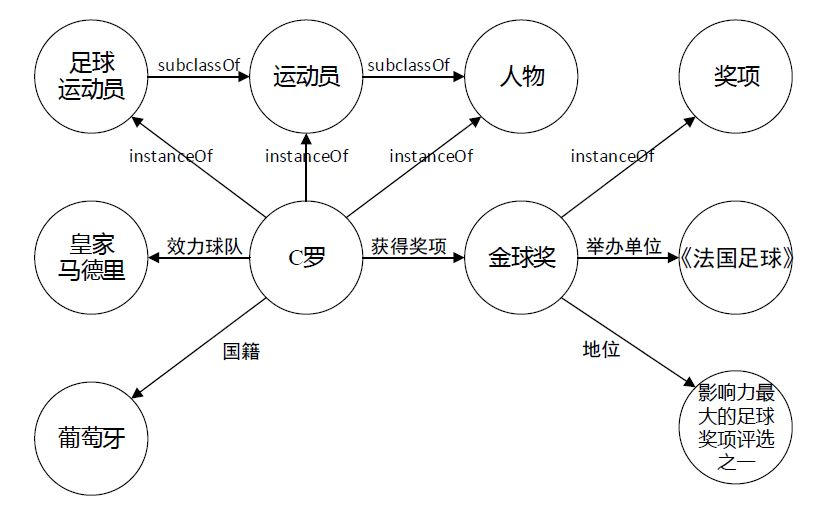
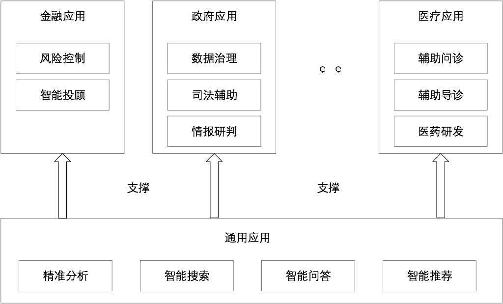

## 知识图谱

### 什么是知识图谱？

知识图谱本质上是一种大规模语义网络。这里关键词就是“语义网络”和“大规模”。

#### 语义网络

语义网络表达了各种各样的实体、概念及其之间的各类语义关联。如下图，可看作一个简单的语义网络。

图中“C罗”是一个实体，“金球奖”也是一个实体，他们俩之间有一个语义关系就是“获得奖项”。“运动员”、“足球运动员”都是概念，后者是前者的子类。

#### 大规模

传统知识库构建主要依靠人工构建、代价高昂、规模有限。举个例子，我国的词林辞海是上万名专家花了10多年编撰而成的，但是它只有十几万词条。而现在任何一个互联网上的知识图谱，比如**DBpedia**，动辄包含上千万实体。人工构建的知识库虽然质量精良，但是规模有限。相比较于那个时代的语义网络，知识图谱规模更大。

**当下，在更多实际场合下，知识图谱是作为一种技术体系，指代大数据时代知识工程的一系列代表性技术进展的总和。**

### 知识图谱的生命周期

知识图谱系统的生命周期包含四个重要环节：**知识表示、知识获取、知识管理与知识应用**。

#### 知识表示

在知识表示方面，常用三元组（主语、谓词、宾语）表示知识图谱。如三元组<七里香，歌曲原唱，周杰伦>表示“七里香这首歌曲的原唱是周杰伦”这一知识。需要强调一点，知识图谱只能表达一些简单的关联事实，但很多领域应用的需求已经远远超出了三元组所能表达的简单关联事实，实际应用日益对于利用更加多元的知识表示丰富和增强知识图谱的语义表达能力提出了需求。

#### 知识获取

知识的获取是个系统工程，步骤如下：

#### 知识管理

知识图谱的主要管理图谱的存储、检索等问题。

知识图谱的原始数据类型一般来说有三类（也是互联网上的三类原始数据）：

- 结构化数据（Structed Data），如关系数据库
- 非结构化数据，如图片、音频、视频
- 半结构化数据 如XML、JSON、百科

如何存储上面这三类数据类型呢？一般有两种选择，一个是通过RDF（资源描述框架）这样的规范存储格式来进行存储，比较常用的有Jena等。

还有一种方法，就是使用图数据库来进行存储，常用的有Neo4j等。

### 知识图谱的应用

### 自底向上构建知识图谱

构建知识图谱是一个迭代更新的过程，根据知识获取的逻辑，每一轮迭代包含三个阶段：

- 信息抽取：从各种类型的数据源中提取出实体、属性以及实体间的相互关系，在此基础上形成本体化的知识表达；
- 知识融合：在获得新知识之后，需要对其进行整合，以消除矛盾和歧义，比如某些实体可能有多种表达，某个特定称谓也许对应于多个不同的实体等；
- 知识加工：对于经过融合的新知识，需要经过质量评估之后（部分需要人工参与甄别），才能将合格的部分加入到知识库中，以确保知识库的质量。

#### 信息抽取

信息抽取（infromation extraction）是知识图谱构建的第1步，其中的关键问题是：如何从异构数据源中自动抽取信息得到候选指示单元？

信息抽取是一种自动化地从半结构化和无结构数据中抽取实体、关系以及实体属性等结构化信息的技术。涉及的关键技术包括：**实体抽取、关系抽取和属性抽取。**

**实体抽取**，也称为**命名实体识别**（named entity recognition，NER），是指从文本数据集中自动识别出命名实体。

文本语料经过实体抽取之后，得到的是一系列离散的命名实体，为了得到语义信息，还需要从相关语料中提取出实体之间的关联关系，通过关系将实体联系起来，才能够形成网状的知识结构。这就是**关系抽取**需要做的事。

**属性抽取**的目标是从不同信息源中采集特定实体的属性信息，如针对某个公众人物，可以从网络公开信息中得到其昵称、生日、国籍、教育背景等信息。

#### 知识融合

通过信息抽取，我们就从原始的非结构化和半结构化数据中获取到了实体、关系以及实体的属性信息。

如果我们将接下来的过程比喻成拼图的话，那么这些信息就是拼图碎片，散乱无章，甚至还有从其他拼图里跑来的碎片、本身就是用来干扰我们拼图的错误碎片。

也就是说：

- 拼图碎片（信息）之间的关系是扁平化的，缺乏层次性和逻辑性；
- 拼图（知识）中还存在大量冗杂和错误的拼图碎片（信息）

那么如何解决这一问题，就是在知识融合这一步里我们需要做的了。

知识融合包括2部分内容：

- 实体链接
- 知识合并

**实体链接**（entity linking）是指对于从文本中抽取得到的实体对象，将其链接到知识库中对应的正确实体对象的操作。

其基本思想是首先根据给定的**实体指称项**，从知识库中选出一组候选实体对象，然后通过**相似度计算**将指称项链接到正确的实体对象。

在前面的实体链接中，我们已经将实体链接到知识库中对应的正确实体对象那里去了，但需要注意的是，实体链接链接的是我们从半结构化数据和非结构化数据那里通过信息抽取提取出来的数据。

那么除了半结构化数据和非结构化数据以外，我们还有个更方便的数据来源——**结构化数据**，如外部知识库和关系数据库。

对于这部分结构化数据的处理，就是我们**知识合并**的内容啦。

#### 知识加工

在前面，我们已经通过**信息抽取**，从原始语料中提取出了实体、关系与属性等知识要素，并且经过**知识融合**，消除实体指称项与实体对象之间的歧义，得到一系列基本的事实表达。

**然而事实本身并不等于知识。**要想最终获得结构化，网络化的知识体系，还需要经历**知识加工**的过程。

知识加工主要包括3方面内容：**本体构建、知识推理和质量评估**。

##### 本体构建

**本体**（ontology）是指工人的概念集合、概念框架，如“人”、“事”、“物”等。

自动化本体构建过程包含三个阶段：

1. 实体并列关系相似度计算
2. 实体上下位关系抽取
3. 本体的生成

比如对下面这个例子，当知识图谱刚得到“阿里巴巴”、“腾讯”、“手机”这三个实体的时候，可能会认为它们三个之间并没有什么差别，但当它去计算三个实体之间的相似度后，就会发现，阿里巴巴和腾讯之间可能更相似，和手机差别更大一些。

这就是第一步的作用，但这样下来，知识图谱实际上还是没有一个上下层的概念，它还是不知道，阿里巴巴和手机，根本就不隶属于一个类型，无法比较。因此我们在实体上下位关系抽取这一步，就需要去完成这样的工作，从而生成第三步的本体。

当三步结束后，这个知识图谱可能就会明白，“阿里巴巴和腾讯，其实都是公司这样一个实体下的细分实体。它们和手机并不是一类。”

##### 知识推理

在我们完成了本体构建这一步之后，一个知识图谱的雏形便已经搭建好了。但可能在这个时候，知识图谱之间大多数关系都是残缺的，缺失值非常严重，那么这个时候，我们就可以使用知识推理技术，去完成进一步的知识发现。

这一块的算法主要可以分为3大类，基于逻辑的推理、基于图的推理和基于深度学习的推理。

##### 质量评估

质量评估也是知识库构建技术的重要组成部分，这一部分存在的意义在于：可以对知识的可信度进行量化，通过舍弃置信度较低的知识来**保障知识库的质量**。

#### 知识更新

------

其他资料

[为什么需要知识图谱？什么是知识图谱？——KG的前世今生](<https://zhuanlan.zhihu.com/p/31726910>)

