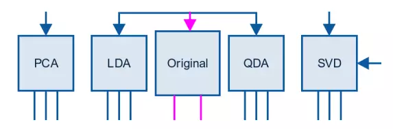
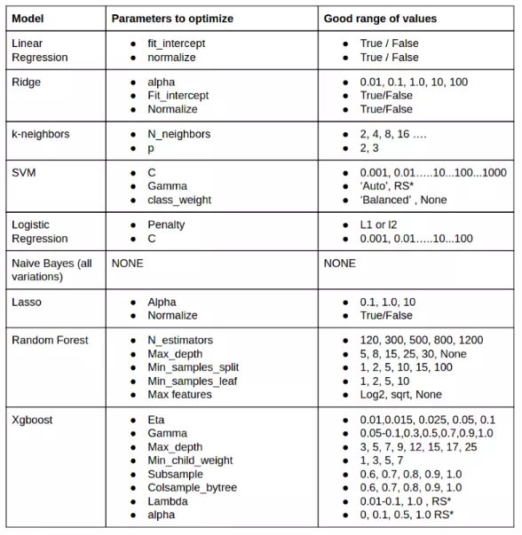

## 机器学习方法

**一般有以下几个步骤：**

- 第一步：识别问题
- 第二步：分离数据
- 第三步：构造提取特征
- 第四步：组合数据
- 第五步：分解
- 第六步：选择特征
- 第七步：选择算法进行训练


#### 识别问题

在这一步先明确这个问题是分类还是回归。通过问题和数据就可以判断出来，数据由 X 和 label 列构成，label 可以一列也可以多列，可以是二进制也可以是实数，当它为二进制时，问题属于分类，当它为实数时，问题属于回归。

用 Training Data 来训练模型，用 Validation Data 来检验这个模型的表现，不然的话，通过各种调节参数，模型可以在训练数据集上面表现的非常出色，但是这可能会是过拟合，过拟合就是太依赖现有的数据了，拟合的效果特别好，但是只适用于训练集，以致于来一个新的数据，就不知道该预测成什么了。所以需要有 Validation 来验证一下，看这个模型是在那里自娱自乐呢，还是真的表现出色。

在 scikit learn 包里就有工具可以帮你做到这些：
 分类问题用 **StrtifiedKFold**

```
from sklearn.cross_validation import StratifiedKFold
```

回归问题用 **KFold**

```
from sklearn.cross_validation import KFold
```

#### 构造特征

这个时候，需要将数据转化成模型需要的形式。数据有三种类型：数字，类别，文字。当数据是类别的形式时，需要将它的每一类提取出来作为单独一列，然后用二进制表示每条记录相应的值。

这个过程 sklearn 也可以帮你做到：

```
from sklearn.preprocessing import LabelEncoder
```

或者

```
from sklearn.preprocessing import OneHotEncoder
```

#### 组合数据

处理完 Feature 之后，就将它们组合到一起。
 如果数据是稠密的，就可以用 numpy 的 hstack:

```
import numpy as np
X = np.hstack((x1, x2, ...))
```

如果是稀疏的，就用 sparse 的 hstack：

```
from scipy import sparse
X = sparse.hstack((x1, x2, ...))
```

组合之后，就可以应用以下算法模型：

- RandomForestClassifier
- RandomForestRegressor
- ExtraTreesClassifier
- ExtraTreesRegressor
- XGBClassifier
- XGBRegressor

但是不能应用线性模型，线性模型之前需要对数据进行正则化而不是上述预处理。

这一步是为了进一步优化模型，可以用以下方法：





**PCA：Principal components analysis，主成分分析**，是一种分析、简化数据集的技术。用于减少数据集的维数，同时保持数据集中的对方差贡献最大的特征。

```
from sklearn.decomposition import PCA
```

对于文字数据，在转化成稀疏矩阵之后，可以用 SVD

```
from sklearn.decomposition import TruncatedSVD
```

**SVD：Singular Value Decomposition，奇异值分解**，是线性代数中一种重要的矩阵分解，它总能找到标准化正交基后方差最大的维度，因此用它进行降维去噪。

#### 选择特征

当特征个数越多时，分析特征、训练模型所需的时间就越长，容易引起“维度灾难”，模型也会越复杂，推广能力也会下降，所以需要剔除不相关或亢余的特征。

常用的算法有完全搜索，启发式搜索，和随机算法。

例如，Random Forest：

```
from sklearn.ensemble import RandomForestClassifier
```

或者 xgboost：

```
import xgboost as xgb
```

对于稀疏的数据，一个比较有名的方法是 chi-2：

```
from sklearn.feature_selection import SelectKBest
from sklearn.feature_selection import chi2
```

#### 选择算法进行训练

选择完最相关的参数之后，接下来就可以应用算法，常用的算法有：

> **Classification**:
>  Random Forest
>  GBM
>  Logistic Regression
>  Naive Bayes
>  Support Vector Machines
>  k-Nearest Neighbors

> **Regression**
>  Random Forest
>  GBM
>  Linear Regression
>  Ridge
>  Lasso
>  SVR

在[scikit－learn](https://link.jianshu.com/?t=http://scikit-learn.org/stable/supervised_learning.html#supervised-learning)里可以看到分类和回归的可用的算法一览，包括它们的原理和例子代码。

但是直接应用算法后，一般精度都不是很理想，这个时候需要调节参数，问题来了，**什么模型需要调节什么参数呢？**



调参之后，也并不就是大功告成，这个时候还是需要去思考，是什么原因造成精度低的，是哪些数据的深意还没有被挖掘到，这个时候需要用**统计和可视化去再一次探索数据**，之后就再走一遍上面的过程。

