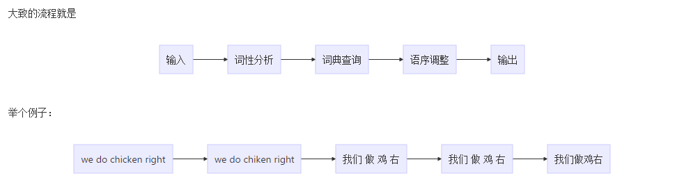

## 自然语言处理

### 应用

- 语音识别系统
- 问答系统
- 机器翻译
- 文本摘要
- 情感分析
- 基于模板的聊天机器人
- 文本分类
- 主题分割

高级应用：

- 为某个主题或图像生成文本
- 类人机器人
- 通用机器翻译系统
- 为人类生成个性化文本并忽略手写错误的高级机器人

### 关键点

词意理解：中国队大胜美国队；中国队大败美国队。“胜”、“败”一对反义词，却表达同样的意思：中国赢了，美国输了。这需要机器能够自动分析出谁胜谁负

自动生成语言：自动生成语言基于语言的自动理解，不理解就无法自动生成

机器翻译：现在机器翻译已经很多了，但是还很难达到最佳，比如我们把中文翻译成英文，再翻译成中文，再翻译成英文，来回10轮，发现和最初差别还是非常大的。

人机对话：这也是我们想做到的最终目标，这里有一个叫做“图灵测试”的方式，也就是在5分钟之内回答提出问题的30%即通过，能通过则认为有智能了。

### 实现方法

目前业内主要的实现手段有基于规则的、基于实例的、基于统计的以及基于神经网络的。

以**机器翻译**为例，我们分别来了解下：

#### 基于规则的机器翻译

基于规则的，也就是完全从语法句法等出发，按照语言的规则来分析和处理，这在上个世纪经历了很多年的试验宣告失败，因为规则太多太多，而且很多语言都不按套路出牌，想象你追赶你的影子，你跑的快他跑的更快，你永远都追不上它。

基于规则的机器翻译，是最古老也是见效最快的一种翻译方式。

根据翻译的方式可以分为：

- 直接基于词的翻译
- 结构转换的翻译
- 中间语的翻译

从字面上理解，基于词的翻译就是直接把词进行翻译，但是也不是这么简单，会通过一些词性的变换、专业词汇的变换、位置的调整等一些规则，进行修饰。



可以看到翻译的质量很差，但是基于这种词规则的翻译，基本上可以辅助我们做一些翻译的工作；而且这种翻译也带来了机器翻译的0到1的飞跃。

那么基于结构转换 其实就是不仅仅考虑单个词，而是考虑到短语的级别。比如根据端与`do chicken`有可能被翻译成`烹饪鸡`，那么整句话就好多了`我们烹饪鸡好吗`

最后一种就是基于中间语的翻译，比如过去在金本位的年代，各国都有自己的货币。中国使用中国的货币，美国使用美国的货币，那么货币之间怎么等价呢？就可以兑换成黄金来衡量价值，这样就可以进行跨币种的买卖了。翻译也是如此，倘若由两种语言无法直译，那么也可以先翻译成中间语，然后通过中间语进行两种语言的翻译。

#### 基于统计的机器翻译

另一派是基于统计的，也就是收集大量的语料数据，通过统计学习的方式来理解语言，这在当代越来越受重视而且已经成为趋势，因为随着硬件技术的发展，大数据存储和计算已经不是问题，无论有什么样的规则，语言都是有统计规律的，当然基于统计也存在缺陷，那就是“小概率事件总是不会发生的”导致总有一些问题解决不了。

首先，我们有一段英文想要把它翻译成汉语：

```
we do chicken right
```

会根据每个词或者短语，罗列它可能出现的翻译结果:

```
我们/做/鸡/右
我们/做/鸡/好吗
我们/干/鸡/怎么样
...
```

这样的结果有很多种...

然后我们需要一个大量的语料库，即有大量的文章...这些文章会提供 每一种翻译结果出现的概率，概率的计算方式可能是使用隐马尔可夫模型，即自己算相邻词的概率，这个原理在《数学之美》中有介绍，感兴趣的可以去看看。

最终挑选概率最高的翻译结果作为最终的输出。

总结来说大致的流程是：


因此可以看到，这种翻译方式依赖大量的语料库，因此大多数使用这种方式而且效果比较好的都是那种搜索引擎公司，比如Google和Baidu。

#### 基于实例的机器翻译

这种翻译也比较常见，通俗点说就是抽取句子的模式，当你输入一句话想要翻译的时候，会搜索相类似的语句，然后替换不一样的词汇翻译。举个例子：

```
I gave zhangsan a pen
I gave lisi an apple
```

就可以抽取他们相似的部分，直接替换不一样的地方的词汇就行。

#### 基于神经网络的机器翻译

在机器翻译中主要使用的是循环神经网络，即上一次的输出可以作为这次的输入继续参与计算。

就是在翻译的过程中，虽然是以句子为单位进行翻译的，但是每一句话都会对下一句话的翻译产生影响，这样就做出了上下文的感觉....比如`do chicken`单纯的翻译有很多中翻译的结果。但是如果前面出现过厨师等这类的词句，那么这个单词就可以更倾向翻译成`烹饪鸡`。


------

其他：

[人机问答系统原理](<https://blog.csdn.net/ch1209498273/article/details/78484921>)

